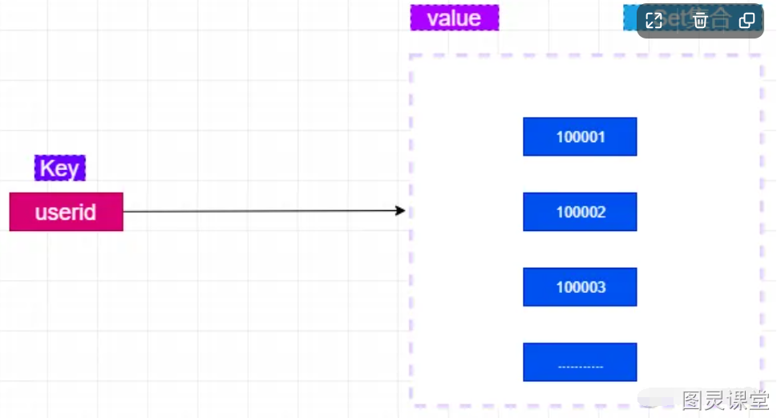
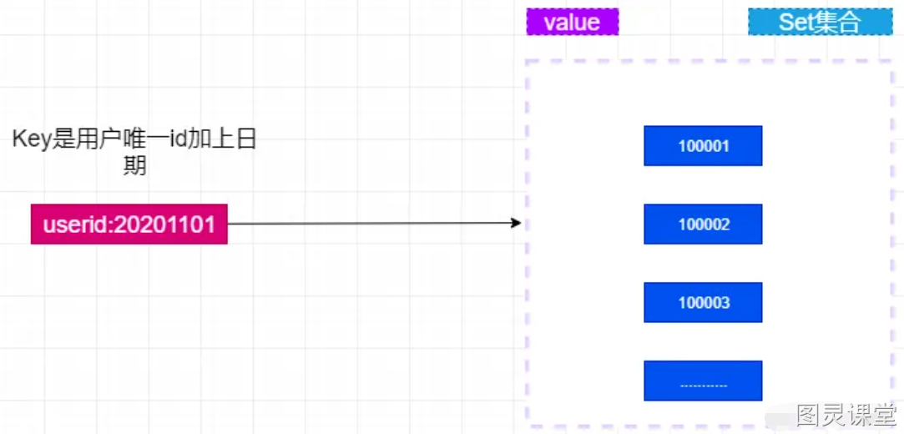
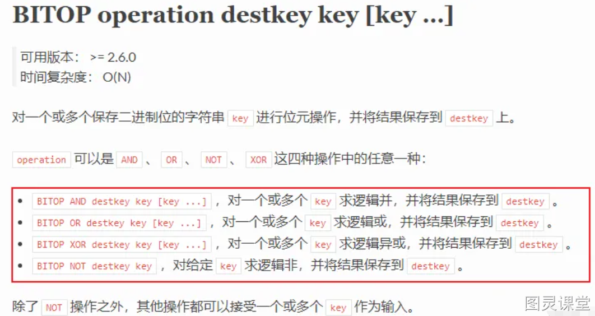
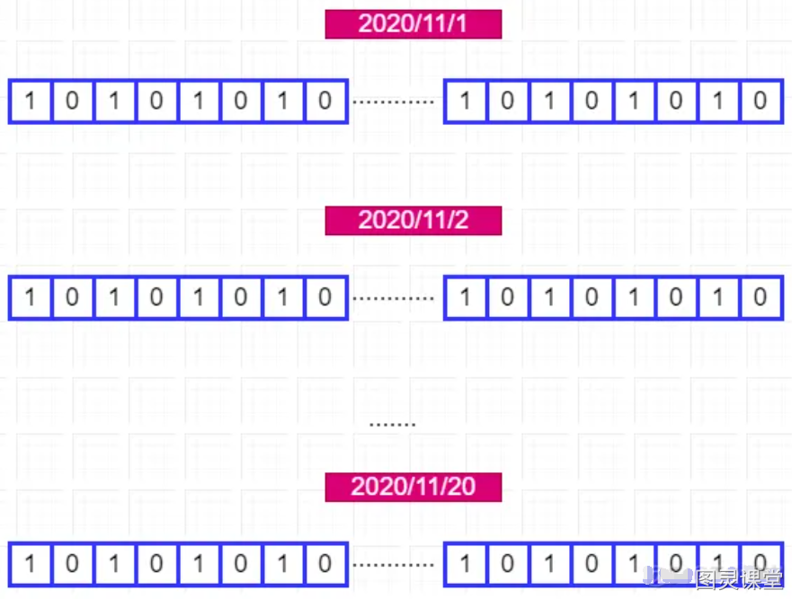
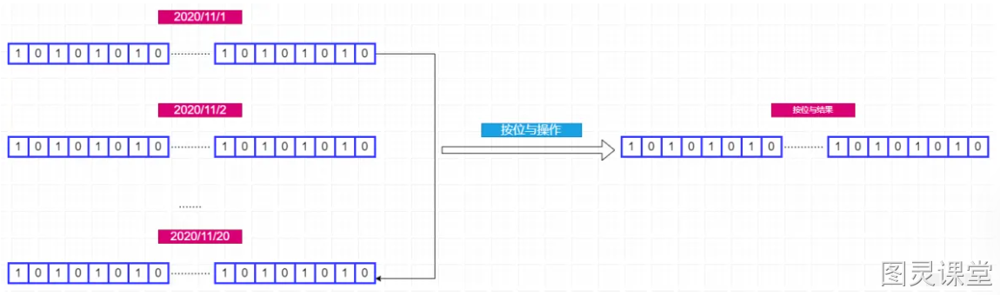
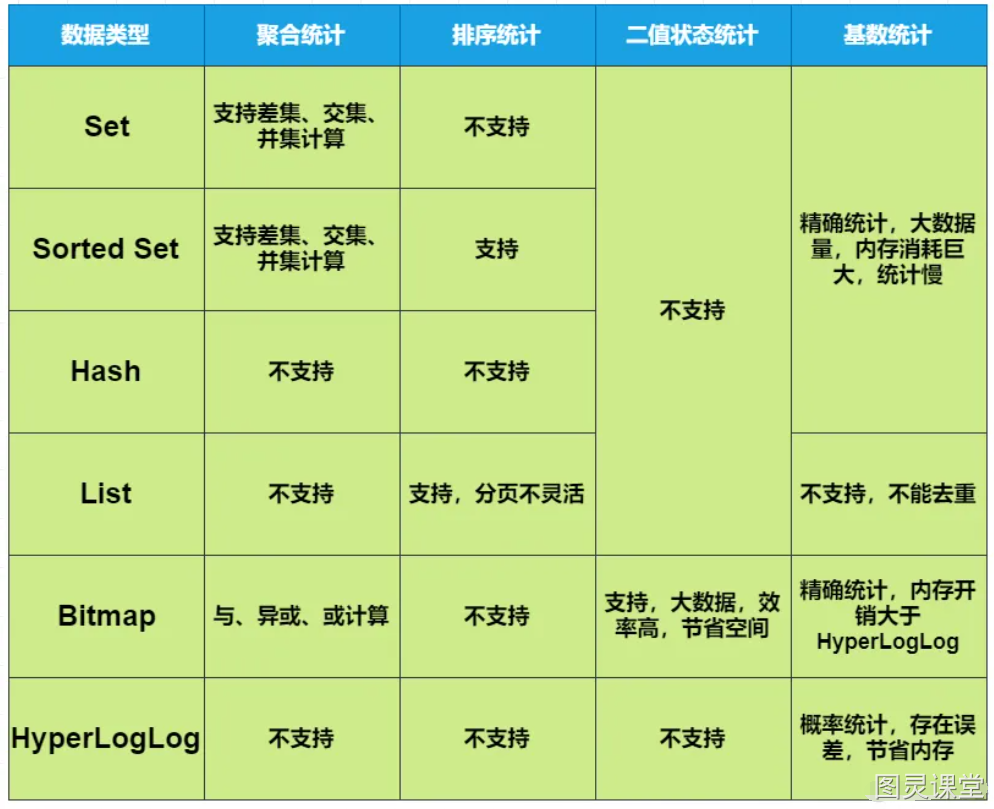

# 给你一亿个Redis keys，如何高效统计

:::info
不知你大规模的用过Redis吗？还是仅仅作为缓存的工具了？在Redis中使用最多的就是集合了，举个例子，如下场景：

1. 签到系统中，一天对应一系列的用户签到记录。
2. 电商系统中，一个商品对应一系列的评论。
3. 交友系统中，某个用户的一系列的好友。

Redis中集合的特点无非是一个Key对应一系列的数据， 但是数据的作用往往是为了统计的，比如：

1. 交友系统中，需要统计每天的新增好友，以及双方的共同好友。
2. 电商系统中，需要统计评论列表中的最新评论。
3. 签到系统中，需要统计连续一个月的签到的用户数量。

大型互联网应用中，数据量是巨大的，少说百万，千万，甚至是一个亿，比如电商巨头淘宝，交友巨头微信、微博；办公巨头钉钉等，哪一个的用户不是上亿？
**只有针对不同场景，选择合适的集合，统计才能更方便。**
:::

## 聚合统计
聚合统计指的是多个元素聚合的结果，比如统计多个集合的**交集**、**并集**、**差集**
**在你需要对多个集合做聚合统计的时候，Set集合是个不错的选择，除了其中无重复的数据外，Redis还提供了对应的API**

### 交集
在上述的例子中交友系统中统计双方的共同好友正是聚合统计中的交集。
在Redis中可以userid作为key，好友的userid作为value，如下图：

统计两个用户的共同好友只需要两个Set集合的交集，命令如下；
```
SINTERSTORE userid:new userid:20002 userid:20003
```
上述命令运行完成后，userid:new这个key中存储的将是userid:20002、userid:20003两个集合的交集。

### 差集
举个例子：假设交友系统中需要统计每日新增的好友，此时就需要对临近两天的好友集合取差集了，比如2020/11/1日的好友是set1，2020/11/2日的好友是set2，此时只需要对set1和set2做差集。
此时的结构应该如何设计呢？如下图：

userid:20201101这个key记录了userid用户的2020/11/1日的好友集合。
差集很简单，只需要执行SDIFFSTORE命令，如下：
```
SDIFFSTORE  user:new  userid:20201102 userid:20201101  
```
执行完毕，此时的user:new这集合将是2020/11/2日新增的好友。
**这里还有一个更贴切的例子，微博上有个可能认识的人功能，可以使用差集，即是你朋友的好友减去你们共同的好友即是可能认识的人。**

### 并集
还是差集的那个例子，假设需要统计2020/11/01和2020/11/2总共新增的好友，此时只需要对这两日新增好友的集合做一个并集。命令如下：
```
SUNIONSTORE  userid:new userid:20201102 userid:20201101
```
此时新的集合userid:new则是两日新增的好友。

### 总结
Set集合的交差并的计算复杂度很高，如果数据量很大的情况下，可能会造成Redis的阻塞。
那么如何规避阻塞呢？建议如下：

1. 在Redis集群中选一个从库专门负责聚合统计，这样就不会阻塞主库和其他的从库了
2. 将数据交给客户端，由客户端进行聚合统计。

## 排序统计
在一些电商网站中可以看到商品的评论总是最新的在上面，这个是怎么做的呢？
最新评论列表包含了所有的评论，这就要**集合对元素进行保序存储**了。也就是说集合中的元素必须按序存储，称之为有序集合。
Redis中的四种集合中List和Sorted Set属于有序集合。
但是List和Sorted Set有何区别呢？到底使用哪一种呢？
**List是按照元素进入顺序进行排序，而Sorted Set可以根据元素权重来排序。** 比如可以根据元素插入集合的时间确定权值，先插入的元素权重小，后插入的元素权重大。
针对这一例子中，显然这两种都是能够满足要求的，List中分页查询命令LRANGE 和Sorted Set分页查询命令ZRANGEBYSCORE。
但是就灵活性来说，List肯定不适合，List只能根据先后插入的顺序排序，但是大多数的场景中可能并不只是按照时间先后排序，可能还会按照一些特定的条件，此时Sorted Set就很合适了，只需要根据独有的算法生成相应的权重即可。

## 二值状态统计
**二值状态指的是取值0或者1两种**；在签到打卡的场景中，只需要记录签到（1）和未签到（0）两种状态，这就是典型的二值状态统计。
二值状态的统计可以使用Redis的扩展数据类型Bitmap，底层使用String类型实现，可以把它看成是一个bit数组。关于详细内容后续介绍.........
在签到统计中，0和1只占了一个bit，即使一年的签到数据才365个bit位。大大减少了存储空间。
Bitmap 提供了GETBIT/SETBIT 操作，使用一个偏移值 offset 对 bit 数组的某一个 bit 位进行读和写。不过，需要注意的是，Bitmap 的偏移量是从 0 开始算的，也就是说 offset 的最小值是 0。当使用 SETBIT 对一个 bit 位进行写操作时，这个 bit 位会被设置为 1。Bitmap 还提供了 BITCOUNT 操作，用来统计这个 bit 数组中所有1的个数。
键值如何设计呢？key可以是userid:yyyyMM，即是唯一id加上月份。假设员工id为10001，需要统计2020/11月份的签到打卡记录。
第一步，执行命令设置值，假设11月2号打卡了，命令如下：
```
SETBIT userid:10001:202011 1 1 
```
BitMap是从下标0开始，因此2号则是下标为1，值设置为1则表示成功打卡了。
第二步，检查该用户11月2号是否打卡了，命令如下：
```
GETBIT userid:10001:202011 1 
```
第三步，统计11月的打卡次数，命令如下：
```
BITCOUNT userid:10001:202011
```
**那么问题来了，需要统计你这个签到系统中连续20天的签到打卡的用户的总数，如何处理呢？假设用户一个亿。**
比如需要统计2020/11/01到2020/11/20天中连续打卡的人数，如何统计呢？
Bitmap中还支持同时对多个BitMap按位做与、或、异或操作，命令如下图：

思路来了，我们可以将每天的日期作为一个key，对应的BitMap存储一亿个用户当天的打卡情况。如下图：

此时我们只需要对2020/11/1到2020/11/20号的Bitmap做按位与操作，最终得到的一个Bitmap中每个bit位置对应的值则代表连续20天打卡的情况，只有连续20天全部打卡，所在的bit位的值才为1。如下图：

最终可以使用BITCOUNT命令进行统计。
可以尝试计算下内存开销，每天使用 1 个 1 亿位的 Bitmap，大约占 12MB 的内存（10^8/8/1024/1024），20 天的 Bitmap 的内存开销约为 240MB，内存压力不算太大。不过，在实际应用时，最好对 Bitmap 设置过期时间，让 Redis 自动删除不再需要的签到记录，以节省内存开销。
**如果涉及到二值状态，比如用户是否存在，签到打卡，商品是否存在等情况可以使用Bitmap，可以有效的节省内存空间。**

## 基数统计
基数统计指统计一个集合中不重复元素的个数。
举个栗子：电商网站中通常需要统计每个网页的UV来确定权重，网页的UV肯定是需要去重的，在Redis类型中Set支持去重，第一时间肯定想到的是Set。
但是这里有一个问题，Set底层使用的是哈希表和整数数组，如果一个网页的UV达到千万级别的话（一个电商网站中何止一个页面），那么对于内存的消耗极大。
**Redis提供了一个扩展类型HyperLogLog用于基数统计，计算2^64个元素大概只需要12KB的内存空间**
是不是很心动？但是HyperLogLog是**存在误差**的，大概是在0.81%，如果需要精准的统计，还是需要使用Set。对于这种网页的UV来说，足够了。
在统计网页UV的时候，只需要将用户的唯一id存入HyperLogLog中，如下：
```
PFADD p1:uv 10001 10002 10003 10004
```
如果存在重复的元素，将会自动去重。
统计也很简单，使用PFCOUNT命令，如下：
```
PFCOUNT p1:uv
```

## 总结
本文介绍了统计的几种类型以及应该用什么集合存储，为了方便理解，作者将支持情况和优缺点汇总了一张表格，如下图：

Set和Sorted Set支持交集、并集的聚合运算，但是Sorted Set不支差集运算。
Bitmap也能对多个Bitmap做与、异或、或的聚合运算。
List和SortedSet都支持排序统计，但是List是根据元素先后插入顺序排序，Sorted Set支持权重，相对于List排序来说更加灵活。
对于二值状态统计，判断某个元素是否存在等场景，建议使用Bitmap，节省的内存空间。
对于基数统计，在大数据量、不要求精准的情况建议使用HyperLogLog，节省内存空间；对于精准的基数统计，最好还是使用Set集合。


> 原文: <https://www.yuque.com/tulingzhouyu/db22bv/ry5xx6vqzph8ymrp>