# 👍 Spring6.0从入门到精通系列教程


## What？Why？
Spring框架是一个基于IoC的框架，它提供了一种实现IoC的方式，即通过依赖注入（Dependency Injection）来实现对象之间的松耦合。在Spring中，对象之间的依赖关系由Spring容器管理和注入，从而使得应用程序的代码与对象之间的依赖关系解耦，提高了代码的可维护性、可测试性和可扩展性。

Spring框架带给我们以下好处：

1. 降低代码耦合度：通过IoC容器管理对象之间的依赖关系，降低了代码的耦合度，使得代码更易于维护和修改。
2. 提高代码可测试性：通过依赖注入，使得测试代码更容易编写，因为测试代码可以更方便地模拟对象之间的依赖关系。
3. 简化配置：Spring框架提供了一种方便的配置方式，使得应用程序的配置更易于管理和维护。
4. 提供了事务管理、安全性、远程调用等方便的功能：Spring框架提供了许多常用的功能，如事务管理、安全性、远程调用等，使得应用程序的开发更加高效和便捷。

总之，Spring框架是一个非常强大的框架，它提供了一种方便的方式来实现IoC和依赖注入，从而提高了应用程序的可维护性、可测试性和可扩展性。


## HelloWorld之引入依赖
```xml
<dependencies>
  <dependency>
    <groupId>org.springframework</groupId>
    <artifactId>spring-context</artifactId>
    <version>6.0.7</version>
  </dependency>
</dependencies>
```
Spring Context 模块是 Spring Framework 的核心模块之一，它提供了一种在应用程序中使用 IoC（Inversion of Control）和 DI（Dependency Injection）的方式，以及许多其他功能，例如事件传递、国际化、资源加载、Bean 生命周期管理等。Spring Context 模块实现了 BeanFactory 接口，是一个 Bean 容器，可以管理应用程序中的所有 Bean 实例。

Spring Context 模块的主要作用包括：

1. 提供了一种方便的方式来管理和装配应用程序中的对象。
2. 管理对象的生命周期，包括对象的创建、初始化和销毁等。
3. 实现了 IoC 和 DI 的机制，将对象之间的依赖关系交由 Spring 容器管理，降低了对象之间的耦合性。
4. 提供了许多其他功能，例如事件传递、国际化、资源加载等，可以帮助开发者更方便地开发企业级应用程序。


## HelloWorld之基本使用
```java
public class Main {
    public static void main(String[] args) {

        // 创建Spring容器
        AnnotationConfigApplicationContext applicationContext = new AnnotationConfigApplicationContext();

        // 向容器中注册一个Bean
        applicationContext.registerBean("userService", UserService.class);

        // 启动Spring容器
        applicationContext.refresh();

        // 获取Bean对象
        UserService userService = (UserService) applicationContext.getBean("userService");

        // 使用Bean对象
        userService.test();
    }
}
```

以上代码完成了向Spring容器中注册一个Bean对象，并把它拿出来使用。

假设现在UserService用到了OrderService，我们可以这么写：
```java
public class UserService {

    @Autowired
    private OrderService orderService;

    public void test(){
        System.out.println(orderService);
    }
}
```

并且把OrderService也注册为Bean：
```java
AnnotationConfigApplicationContext applicationContext = new AnnotationConfigApplicationContext();
applicationContext.registerBean("userService", UserService.class);
applicationContext.registerBean("orderService", OrderService.class);
applicationContext.refresh();
```

这样UserService中的orderService属性就自动有值了，这个功能就是Spring给我们提供的，叫做依赖注入。

假如现在UserService中有一个Map，需要缓存一部分用户信息，我们可以通过一下方式来进行初始化：
```java
public class UserService implements InitializingBean {

    @Autowired
    private OrderService orderService;

    private Map<String, User> vipUserInfo = new HashMap<>();

    @Override
    public void afterPropertiesSet() throws Exception {
        vipUserInfo.put("001", new User());
        vipUserInfo.put("002", new User());
        vipUserInfo.put("003", new User());
    }

    public void test(){
        System.out.println(orderService);
        System.out.println(vipUserInfo.size());
    }
}
```

Spring容器在创建UserService这个Bean对象时会自动调用afterPropertiesSet()方法，然后完成对vipUserInfo的初始化。


## IoC之Bean的注解配置
我们也可以通过注解的方式来注册Bean，比如：
```java
@Configuration
public class AppConfig {

    @Bean
    public OrderService orderService(){
        return new OrderService();
    }

    @Bean
    public UserService userService(){
        return new UserService();
    }
}
```

AppConfig表示是一个Spring容器的配置类，利用通过@Bean定义了Bean，方法名为beanName，方法返回类型为bean类型。

不过需要把AppConfig注册给Spring容器：
```java
AnnotationConfigApplicationContext applicationContext = new AnnotationConfigApplicationContext();
applicationContext.register(AppConfig.class);
applicationContext.refresh();
```

除开通过@Bean可以定义Bean以外，我们还可以通过让Spring容器扫描来自动发现Bean，比如：
```java
@Configuration
@ComponentScan("com.zhouyu")
public class AppConfig {


}
```

我们通过@ComponentScan("com.zhouyu")指定了扫描路径，Spring会扫描指定包下的所有类（接口除外），只要类上有@Component注解，那么就相当于发现了一个Bean，当前类就是Bean类型，类名首字母小写就是beanName。

```java
@Component
public class OrderService {

}
```

@Bean 用于将一个方法返回的对象注册为一个 Bean，通常用于显式地声明需要被 Spring 管理的对象。该注解通常和 @Configuration 注解一起使用，用于配置应用程序的组件。在配置类中，@Bean 注解可以修饰一个方法，这个方法返回的对象会被注册为一个 Bean，并由 Spring 容器管理。
@Component 用于将一个类声明为一个组件，通常用于隐式地声明需要被 Spring 管理的对象。该注解将类标记为一个 Spring Bean，可以使用该类的实例进行依赖注入。在使用 @Component 注解时，Spring 会自动扫描这个类，并将其实例化并注册到 Spring 容器中。


## IoC之Bean的实例化
Bean的实例化就是利用类的构造方法并通过反射实例化出来一个对象，此时对象还没有经过依赖注入、初始化等步骤。


## IoC之Bean的依赖查找
在Spring中，依赖查找是指从容器中获取bean实例的过程。Spring容器负责维护对象的创建和管理，可以通过依赖注入(Dependency Injection)或者依赖查找(Dependency Lookup)的方式来获取bean实例。
在依赖查找中，客户端代码通过向容器请求指定名称或类型的bean来获取实例。Spring容器会检查该bean是否存在，如果存在就返回该bean的实例；如果不存在，则会抛出异常或者返回null。
在Spring中，依赖查找可以通过多种方式实现，包括使用ApplicationContext接口的getBean()方法、使用BeanFactory接口的getBean()方法、使用@Autowire注解等。依赖查找通常在需要使用特定bean的地方进行调用，例如在业务逻辑层或控制器中获取DAO对象、获取服务对象等。

## Ioc之Bean的依赖注入
Spring 中的依赖注入和依赖查找是两种不同的依赖处理方式，它们之间有一些明显的区别和联系。
依赖注入是指将对象之间的依赖关系交给 Spring 容器来管理，容器负责在运行时自动将依赖注入到对象中，对象本身不需要关心依赖如何获取。依赖注入的主要优点是可以将不同的组件解耦，便于进行单元测试和模块化开发。
依赖查找则是指对象主动从容器中获取依赖对象，即对象自己主动去容器中寻找依赖。依赖查找通常用于解决依赖对象无法通过依赖注入的情况，或者在某些特定场景下需要手动获取依赖对象的情况下使用。
尽管依赖注入和依赖查找有不同的用途，但它们并不是相互排斥的。事实上，Spring 容器同时支持依赖注入和依赖查找，因此在需要的情况下可以选择使用不同的方式来获取依赖。此外，通过使用不同的依赖处理方式，我们可以更灵活地组织和管理对象之间的依赖关系。

## IoC之@Autowired注解
@Autowired注解在查找要注入的bean时，首先会按照类型进行匹配。如果有多个匹配的bean，就会根据名称进行匹配。
具体来说，如果被注入的属性或构造函数参数的类型在容器中有且只有一个对应的bean，那么@Autowired注解就会直接将该bean注入到该属性或构造函数参数中。例如：
```java
@Autowired
private UserService userService;
```
在这个例子中，如果容器中只有一个类型为UserService的bean，那么它就会被自动注入到userService属性中。
但是，如果容器中存在多个类型为UserService的bean，就需要通过名称进行匹配。此时，可以在@Autowired注解中使用@Qualifier注解来指定要注入的bean的名称，如果不使用@Qualifier注解就会使用属性名。

例如：
```java
@Autowired
@Qualifier("userService2")
private UserService userService;
```
在这个例子中，如果容器中有多个类型为UserService的bean，那么它会根据@Qualifier注解中指定的名称来匹配要注入的bean。如果找到了名为"userService2"的bean，就会将它注入到userService属性中。

Autowired注解会优先按照类型进行匹配，如果存在多个匹配的bean，就会再按照名称进行匹配。如果仍然无法找到唯一的匹配项，就会抛出异常。

## IoC之@Resource注解
在Spring中，@Resource注解可以通过名称或者类型来注入bean，具体取决于@Resource注解的两个属性：name和type。
如果@Resource注解中指定了name属性，Spring将会根据该名称来查找对应的bean，并将其注入到被注解的属性或者方法参数中。例如：
```java
@Resource(name = "myBean")
private MyBean myBean;
```
上述代码将会根据名称“myBean”来查找对应的bean，并将其注入到myBean属性中。
如果@Resource注解没有指定name属性，而是指定了type属性，Spring将会根据该类型来查找对应的bean，并将其注入到被注解的属性或者方法参数中。例如：
```java
@Resource(type = MyBean.class)
private MyBean myBean;
```
上述代码将会根据类型MyBean来查找对应的bean，并将其注入到myBean属性中。
如果@Resource注解既没有指定name属性，也没有指定type属性，那么它会默认按照名称来查找对应的bean，并将其注入到被注解的属性或者方法参数中。例如：
```java
@Resource
private MyBean myBean;
```
上述代码将会默认按照名称“myBean”来查找对应的bean，并将其注入到myBean属性中。


## IoC之Bean的初始化
在 Spring 中，我们可以通过两种方式在 bean 实例化后执行一些初始化操作：使用 init-method 属性或者实现 InitializingBean 接口中的 afterPropertiesSet() 方法。

### init-method 属性
init-method 属性是在 XML 配置文件中设置的，用于指定 bean 实例化后需要调用的方法名。例如：
```xml
<bean id="myBean" class="com.example.MyBean" init-method="init">
  <property name="someProperty" value="someValue" />
</bean>
```
这里的 init-method 属性指定了 MyBean 类中的 init() 方法，该方法会在 bean 实例化后被自动调用。

### InitializingBean 接口
InitializingBean 是 Spring 框架中的一个接口，其中只有一个方法 afterPropertiesSet()。如果我们的 bean 类实现了这个接口，Spring 容器在初始化 bean 后会自动调用该方法。例如：
```java
public class MyBean implements InitializingBean {

    private String someProperty;

    public void setSomeProperty(String someProperty) {
        this.someProperty = someProperty;
    }

    @Override
    public void afterPropertiesSet() throws Exception {
        // 执行一些初始化操作
    }
}
```
在上面的代码中，我们实现了 InitializingBean 接口，并重写了 afterPropertiesSet() 方法。当 Spring 容器初始化 MyBean 实例时，会自动调用该方法。
需要注意的是，使用 init-method 属性和实现 InitializingBean 接口的效果是相同的。如果都设置了，Spring 容器会先调用 afterPropertiesSet() 方法，再调用 init-method 属性指定的方法。

## IoC之Bean的初始化前
```xml
<dependency>
  <groupId>jakarta.annotation</groupId>
  <artifactId>jakarta.annotation-api</artifactId>
  <version>2.1.0</version>
</dependency>
```

```java
@PostConstruct
private void init() {
    System.out.println("init...");
}
```

在Spring框架中，@PostConstruct是一个注解，用于指定一个方法在Bean初始化之前执行。这个注解可以用于任何方法，但通常用于一个类的初始化方法，例如设置一些默认值或者建立一些连接等操作。
具体来说，当一个Bean被Spring容器创建之后，如果它的类中有一个使用了@PostConstruct注解的方法，那么这个方法会在Bean的依赖注入之后和初始化过程之前被调用。也就是说，在Bean的构造函数执行之后，但在Bean被放入容器之前，@PostConstruct方法将被调用。
需要注意的是，如果一个类中有多个使用了@PostConstruct注解的方法，它们的执行顺序并不能得到保证，因此应该尽量避免在不同的@PostConstruct方法之间有相互依赖的情况。
总之，@PostConstruct注解是一个非常有用的Spring特性，可以帮助我们在Bean初始化完成之后执行一些必要的操作。


## IoC之Bean的初始化后
初始化后最核心的就是AOP


## IoC之Bean的销毁
在Spring中，Bean的销毁可以通过两种方式来实现。

### DisposableBean接口
第一种方式是在Bean类中实现DisposableBean接口，并且实现它的destroy()方法。当Spring容器关闭时，会调用该方法来销毁Bean。
例如，下面是一个实现了DisposableBean接口的类：
```java
public class MyBean implements DisposableBean {

    @Override
    public void destroy() throws Exception {
        // 执行Bean销毁操作
    }
}
```
第二种方式是通过在Bean的配置文件中使用<bean>标签的destroy-method属性来指定一个销毁方法。当Spring容器关闭时，会调用该方法来销毁Bean。
例如，下面是一个在配置文件中指定销毁方法的例子：
```xml
<bean id="myBean" class="com.example.MyBean" destroy-method="destroy"/>
```
在上面的例子中，当Spring容器关闭时，会调用MyBean类的destroy()方法来销毁该Bean。
无论是哪种方式，Spring容器在销毁Bean时都会先调用销毁方法，然后再释放Bean占用的资源。在销毁方法中，我们可以进行一些清理操作，如关闭数据库连接、释放文件句柄等。


### destroy-method属性
除了在Bean类中实现DisposableBean接口和在XML配置文件中指定destroy-method属性以外，Spring还支持使用@PreDestroy注解来标记Bean销毁时需要执行的方法。
@PreDestroy注解可以用在方法上，表示该方法将在Bean被销毁之前执行。与实现DisposableBean接口或者指定destroy-method属性不同的是，使用@PreDestroy注解不需要实现特定的接口或者指定方法名，而只需要在需要执行的方法上添加该注解即可。例如：
```java
public class MyBean {

    @PreDestroy
    public void cleanup() {
        // 执行Bean销毁前的清理操作
    }
}
```
当Spring容器销毁该Bean时，它会自动调用cleanup()方法。

需要注意的是，如果一个Bean同时实现了DisposableBean接口和使用了@PreDestroy注解，那么销毁时会先调用@PreDestroy注解标记的方法，再调用DisposableBean接口的destroy()方法。


## AOP之简介
在Spring AOP中，Advice、Join Point和PointCut是实现面向切面编程的三个核心概念。

- Advice：Advice是指在应用程序执行过程中，我们可以插入的代码。这些代码可以在应用程序执行的不同时间点执行，如在方法调用前、调用后或抛出异常时。Advice定义了切面的具体行为，如记录日志、权限校验等。
- Join Point：Join Point是指应用程序中可以插入Advice的点。例如，在方法调用期间、抛出异常时或在对象创建时等。Spring AOP仅支持方法级别的Join Point。
- PointCut：PointCut是指一组Join Point的集合，用于定义Advice在何处执行。通过指定PointCut，我们可以将Advice仅应用于应用程序的某些部分，而忽略其他部分。

下面是一些Spring AOP中Advice、Join Point和PointCut的示例：

- Advice示例：在方法调用之前记录日志
```java
public class LoggingAdvice implements MethodBeforeAdvice {
    public void before(Method method, Object[] args, Object target) throws Throwable {
        System.out.println("Entering method: " + method.getName() + " with arguments: " + Arrays.toString(args));
    }
}
```

- Join Point示例：在方法调用期间插入Advice
```java
public class UserService {
    public void addUser(User user) {
        // 添加用户到数据库中
    }
}
```

- PointCut示例：仅应用Advice到UserService的addUser方法
```java
@Aspect
public class LoggingAspect {
    
    @Pointcut("execution(* com.example.UserService.addUser(..))")
    public void addUserPointcut() {}

    @Before("addUserPointcut()")
    public void logBeforeAddUser() {
        System.out.println("Before addUser method called");
    }
    
}
```


## AOP之Advice类型

1. MethodBeforeAdvice，在方法执行之前的切面逻辑
```java

/**
 * @author 周瑜
 */
public class ZhouyuBeforeAdvice implements MethodBeforeAdvice {

	@Override
	public void before(Method method, Object[] args, Object target) throws Throwable {
		System.out.println("方法执行前执行");
	}
}
```

2. AfterReturningAdvice，方法返回后执行的切面逻辑
```java
/**
 * @author 周瑜
 */
public class ZhouyuAfterReturningAdvice implements AfterReturningAdvice {

	@Override
	public void afterReturning(Object returnValue, Method method, Object[] args, Object target) throws Throwable {
		System.out.println("方法return后执行");
	}
}

```

3. ThrowsAdvice，方法抛异常后执行的切面逻辑
```java
/**
 * @author 周瑜
 */
public class ZhouyuThrowsAdvice implements ThrowsAdvice {

	public void afterThrowing(Method method, Object[] args, Object target, NullPointerException ex) {
		System.out.println("方法抛出异常后执行");
	}

}
```

4. MethodInterceptor，任意控制
```java
/**
 * @author 周瑜
 */
public class ZhouyuAroundAdvice implements MethodInterceptor {

	@Nullable
	@Override
	public Object invoke(@NotNull MethodInvocation invocation) throws Throwable {
		System.out.println("方法执行Around前");
		Object proceed = invocation.proceed();
		System.out.println("方法执行Around后");
		return proceed;
	}
}
```

## AOP之Advisor

Advisor=Pointcut+Advice
```java

/**
 * @author 周瑜
 */
public class AdviceDemo {

    public static void main(String[] args) {
        UserService target = new UserService();

        ProxyFactory proxyFactory = new ProxyFactory();
        proxyFactory.setTarget(target);
        proxyFactory.addAdvisor(new PointcutAdvisor() {
            @Override
            public Pointcut getPointcut() {
                return new StaticMethodMatcherPointcut() {
                    @Override
                    public boolean matches(Method method, Class<?> targetClass) {
                        return method.getName().equals("testAbc");
                    }
                };
            }

            @Override
            public Advice getAdvice() {
                return new MethodInterceptor() {
                    @Override
                    public Object invoke(MethodInvocation invocation) throws Throwable {
                        System.out.println("before...");
                        Object result = invocation.proceed();
                        System.out.println("after...");
                        return result;
                    }
                };
            }

            @Override
            public boolean isPerInstance() {
                return false;
            }
        });

        UserInterface userService = (UserInterface) proxyFactory.getProxy();
        userService.test();
    }
}
```

BeanNameAutoProxyCreator，可以指定要代理的Bean的beanName，并设置切面逻辑
```java
@Bean
public BeanNameAutoProxyCreator beanNameAutoProxyCreator() {
	BeanNameAutoProxyCreator beanNameAutoProxyCreator = new BeanNameAutoProxyCreator();
	beanNameAutoProxyCreator.setBeanNames("userSe*");
	beanNameAutoProxyCreator.setInterceptorNames("zhouyuAroundAdvice");
	beanNameAutoProxyCreator.setProxyTargetClass(true);

    return beanNameAutoProxyCreator;
}
```

DefaultAdvisorAutoProxyCreator是一个BeanPostProcessor，会在某个Bean的生命周期中去寻找和它匹配的Advisor，然后生成对应的代理对象作为Bean对象。
```java
@Bean
public DefaultPointcutAdvisor defaultPointcutAdvisor(){
	NameMatchMethodPointcut pointcut = new NameMatchMethodPointcut();
	pointcut.addMethodName("test");

    DefaultPointcutAdvisor defaultPointcutAdvisor = new DefaultPointcutAdvisor();
	defaultPointcutAdvisor.setPointcut(pointcut);
	defaultPointcutAdvisor.setAdvice(new ZhouyuAfterReturningAdvice());

    return defaultPointcutAdvisor;
}

@Bean
public DefaultAdvisorAutoProxyCreator defaultAdvisorAutoProxyCreator() {
	
    DefaultAdvisorAutoProxyCreator defaultAdvisorAutoProxyCreator = new DefaultAdvisorAutoProxyCreator();

	return defaultAdvisorAutoProxyCreator;
}
```

## AOP之AspectJ
AspectJ也是一个实现了AOP思想的项目，它是基于编译期来实现的，而Spring AOP是基于动态代理来实现的，只不过Spring AOP中使用了AspectJ所定义的几个注解，但是注解背后的实现原理是不一样的，一个是编辑期，一个是动态代理。

```xml
<dependency>
  <groupId>org.aspectj</groupId>
  <artifactId>aspectjrt</artifactId>
  <version>1.9.5</version>
</dependency>
<dependency>
  <groupId>org.aspectj</groupId>
  <artifactId>aspectjweaver</artifactId>
  <version>1.9.5</version>
</dependency>
```

### @Before
```java
import org.aspectj.lang.JoinPoint;
import org.aspectj.lang.annotation.Aspect;
import org.aspectj.lang.annotation.Before;

@Aspect
public class LoggingAspect {

    @Before("execution(* com.example.service.*.*(..))")
    public void logBefore(JoinPoint joinPoint) {
        System.out.println("Before executing " + joinPoint.getSignature());
    }

}
```
上述代码中，定义了一个名为LoggingAspect的切面，使用@Before注解表示该方法是一个前置通知，在切入点表达式execution(* com.example.service.*.*(..))中，使用通配符*表示任意返回类型、任意类、任意方法名，括号内的..表示任意参数个数和类型。
当应用程序中被切入点表达式匹配到的任何一个方法被调用时，LoggingAspect中的logBefore方法都会被执行，并在控制台输出相应的日志信息。


### @AfterReturning
```java
import org.aspectj.lang.annotation.AfterReturning;
import org.aspectj.lang.annotation.Aspect;

@Aspect
public class LoggingAspect {

    @AfterReturning(pointcut = "execution(* com.example.service.*.*(..))", returning = "result")
    public void logAfterReturning(JoinPoint joinPoint, Object result) {
        System.out.println("After executing " + joinPoint.getSignature() + ", result: " + result);
    }

}
```
上述代码中，定义了一个名为LoggingAspect的切面，使用@AfterReturning注解表示该方法是一个后置通知，pointcut属性表示切入点表达式，returning属性表示方法返回值绑定到result参数上。
当匹配到的方法正常返回时，LoggingAspect中的logAfterReturning方法会被执行，并在控制台输出相应的日志信息，包括返回值。


### @AfterThrowing
```java
import org.aspectj.lang.annotation.AfterThrowing;
import org.aspectj.lang.annotation.Aspect;

@Aspect
public class LoggingAspect {

    @AfterThrowing(pointcut = "execution(* com.example.service.*.*(..))", throwing = "exception")
    public void logAfterThrowing(JoinPoint joinPoint, Throwable exception) {
        System.out.println("Exception occurred in " + joinPoint.getSignature() + ", exception: " + exception);
    }

}
```
上述代码中，定义了一个名为LoggingAspect的切面，使用@AfterThrowing注解表示该方法是一个异常通知，pointcut属性表示切入点表达式，throwing属性表示抛出的异常绑定到exception参数上。
当匹配到的方法抛出异常时，LoggingAspect中的logAfterThrowing方法会被执行，并在控制台输出相应的日志信息，包括异常信息。


### @After
```java
import org.aspectj.lang.annotation.After;
import org.aspectj.lang.annotation.Aspect;

@Aspect
public class LoggingAspect {

    @After("execution(* com.example.service.*.*(..))")
    public void logAfter(JoinPoint joinPoint) {
        System.out.println("After executing " + joinPoint.getSignature());
    }

}
```
上述代码中，定义了一个名为LoggingAspect的切面，使用@After注解表示该方法是一个最终通知，pointcut属性表示切入点表达式。
当匹配到的方法执行完成后，LoggingAspect中的logAfter方法会被执行，并在控制台输出相应的日志信息。


### @Around
```java
import org.aspectj.lang.ProceedingJoinPoint;
import org.aspectj.lang.annotation.Around;
import org.aspectj.lang.annotation.Aspect;

@Aspect
public class LoggingAspect {

    @Around("execution(* com.example.service.*.*(..))")
    public Object logAround(ProceedingJoinPoint proceedingJoinPoint) throws Throwable {
        System.out.println("Before executing " + proceedingJoinPoint.getSignature());
        Object result = null;
        try {
            result = proceedingJoinPoint.proceed();
        } catch (Throwable e) {
            System.out.println("Exception occurred in " + proceedingJoinPoint.getSignature() + ", exception: " + e);
            throw e;
        }
        System.out.println("After executing " + proceedingJoinPoint.getSignature() + ",result: " + result);
    }
}
```


## AOP之Spring事务


## AOT之什么是AOT
Ahead-of-Time（AOT）的概念源自编译器技术领域。它是一种编译策略，与另一种常见的编译策略Just-in-Time（JIT）相对。JIT编译器在程序运行时将字节码翻译为机器码，而AOT编译器在程序运行之前将字节码转换为机器码。
AOT编译器最初是为了解决JIT编译器的性能瓶颈而引入的。在某些情况下，JIT编译器的性能比AOT编译器慢，特别是在处理大型应用程序时。通过使用AOT编译器，可以在应用程序启动之前编译整个程序，从而加快应用程序的启动时间，并提高应用程序的性能。
现在，AOT编译器已经广泛应用于许多领域，包括桌面应用程序、嵌入式系统、移动应用程序等。


## AOT之Java码、字节码、机器码、汇编码之间的区别
Java码、字节码、机器码和汇编码是不同层次的计算机代码。下面是它们之间的区别：

1. Java码：Java是一种高级编程语言，用于编写跨平台的应用程序。Java代码是用Java编写的源代码，它需要编译成字节码才能在Java虚拟机（JVM）上执行。
2. 字节码：字节码是Java代码编译后生成的中间代码，它是一种二进制格式的代码，可以在任何支持Java虚拟机的计算机上运行。Java字节码包含了许多指令，例如加载、存储、算术操作等，这些指令被JVM解释执行。
3. 机器码：机器码是一种二进制代码，它是计算机能够理解和执行的代码。机器码通常是由汇编语言或者其他低级语言编写的程序经过汇编或编译后生成的。
4. 汇编码：汇编码是一种低级编程语言，它是机器语言的助记符表示法。汇编语言通常由人类编写，并且需要被汇编器转换成机器码才能被计算机执行。

简单来说，Java代码是高级语言，需要编译成字节码才能在虚拟机上执行；字节码是中间代码，可以在任何支持Java虚拟机的计算机上运行；机器码是计算机能够理解和执行的代码；汇编码是机器语言的助记符表示法。

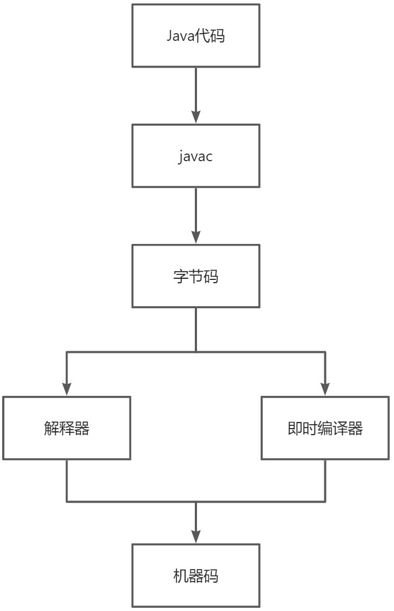


## AOT之什么是Spring AOT
在传统的Java应用程序中，应用程序的启动通常需要进行大量的类加载和动态代理生成等操作，这些操作会消耗大量的时间和内存，从而导致应用程序的启动速度较慢。
为了解决这个问题，Spring团队开发了Spring AOT技术，通过在构建时对应用程序进行静态分析和编译，从而消除了动态代理和反射等运行时操作，提高了应用程序的启动速度和内存使用效率。
Spring AOT的产生背景是因为随着云原生应用的发展，应用程序的启动速度变得越来越重要。在云原生环境中，应用程序的部署和扩展需要快速响应，因此，应用程序的启动速度成为了一项关键的指标。Spring AOT技术的出现，能够有效提高Spring应用程序的启动速度和内存使用效率，使其更适合在云原生环境中运行。

## AOT之什么是GraalVM
GraalVM旨在加速Java应用程序的性能，同时消耗更少的资源。GraalVM提供了两种运行Java应用程序的方式：在HotSpot JVM上使用Graal即时编译器或作为预先编译的本地可执行文件（AOT）。除了Java，它还提供了JavaScript、Ruby、Python和许多其他流行语言的运行时。GraalVM的多语言能力使得可以在单个应用程序中混合编程语言，同时消除不同语言之间调用的成本。
GraalVM文章推荐：[https://mp.weixin.qq.com/mp/appmsgalbum?__biz=MzI3MDI5MjI1Nw==&action=getalbum&album_id=2761361634840969217&scene=173&from_msgid=2247484273&from_itemidx=1&count=3&nolastread=1#wechat_redirect](https://mp.weixin.qq.com/mp/appmsgalbum?__biz=MzI3MDI5MjI1Nw==&action=getalbum&album_id=2761361634840969217&scene=173&from_msgid=2247484273&from_itemidx=1&count=3&nolastread=1#wechat_redirect)

## GraalVM体验

### 下载压缩包
打开[https://github.com/graalvm/graalvm-ce-builds/releases](https://github.com/graalvm/graalvm-ce-builds/releases)，按JDK版本下载GraalVM对应的压缩包，请下载**Java 17对应**的版本，不然后面运行SpringBoot3可能会有问题。
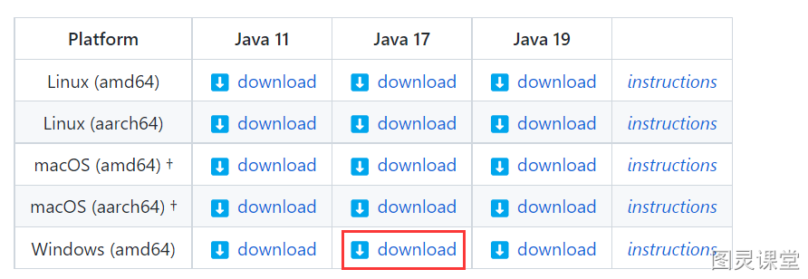

windows的同学直接给大家：[附件: graalvm-ce-java17-windows-amd64-22.3.0.zip](./attachments/cJlXoIh2qGXO5pOU/graalvm-ce-java17-windows-amd64-22.3.0.zip)

下载完后，就解压，


### 配置环境变量
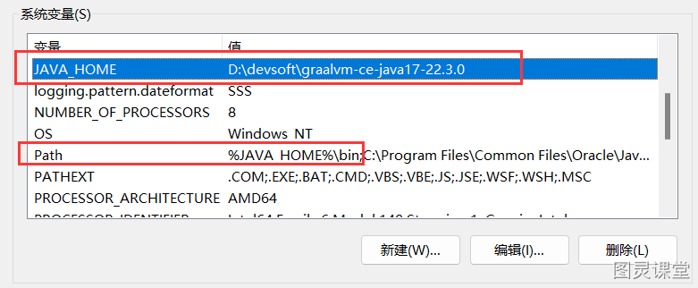


新开一个cmd测试：
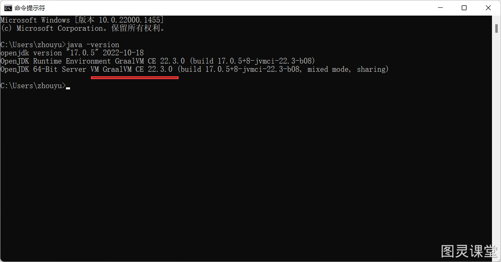


### 安装Visual Studio Build Tools
因为需要C语言环境，所以需要安装Visual Studio Build Tools。

打开[visualstudio.microsoft.com](https://visualstudio.microsoft.com/thank-you-downloading-visual-studio/?sku=BuildTools&rel=16)，下载Visual Studio Installer。

选择C++桌面开发，和Windows 11 SDK，然后进行下载和安装，安装后重启操作系统。


## 
要使用GraalVM，不能使用普通的windows自带的命令行窗口，得使用VS提供的** x64 Native Tools Command Prompt for VS 2019**，如果没有可以执行`C:\Program Files (x86)\Microsoft Visual Studio\2019\BuildTools\VC\Auxiliary\Build\vcvars64.bat`脚本来安装。

安装完之后其实就可以在 **x64 Native Tools Command Prompt for VS 2019**中去使用`native-image`命令去进行编译了。

但是，如果后续在编译过程中编译失败了，出现以下错误：


那么可以执行cl.exe，如果是中文，那就得修改为英文。

通过Visual Studio Installer来修改，比如：
可能一开始只选择了中文，手动选择英文，去掉中文，然后安装即可。

再次检查


这样就可以正常的编译了。


### Hello World实战
新建一个简单的Java工程：
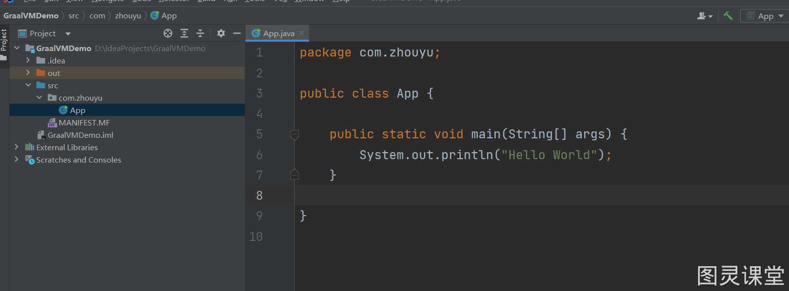

我们可以直接把graalvm当作普通的jdk的使用
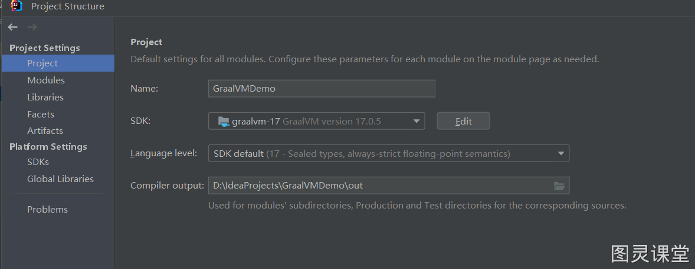

我们也可以利用native-image命令来将字节码编译为二进制可执行文件。

打开**x64 Native Tools Command Prompt for VS 2019**，进入工程目录下，并利用javac将java文件编译为class文件：`javac -d . src/com/zhouyu/App.java`
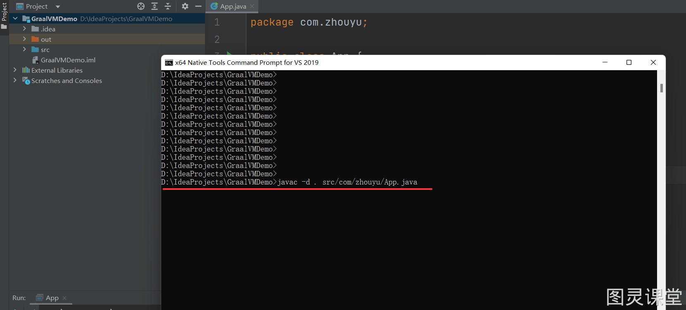

此时的class文件因为有main方法，所以用java命令可以运行


我们也可以利用native-image来编译：

编译需要一些些。。。。。。。时间。


编译完了之后就会在当前目录生成一个exe文件：
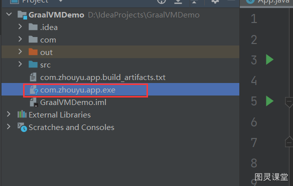

我们可以直接运行这个exe文件：


并且**运行这个exe文件是不需要操作系统上安装了JDK环境的。**

我们可以使用-o参数来指定exe文件的名字：
```java
native-image com.zhouyu.App -o app
```

### GraalVM的限制
GraalVM在编译成二进制可执行文件时，需要确定该应用到底用到了哪些类、哪些方法、哪些属性，从而把这些代码编译为机器指令（也就是exe文件）。但是我们一个应用中某些类可能是动态生成的，也就是应用运行后才生成的，为了解决这个问题，GraalVM提供了配置的方式，比如我们可以在编译时告诉GraalVM哪些方法会被反射调用，比如我们可以通过reflect-config.json来进行配置。

## SpringBoot 3.0实战

然后新建一个Maven工程，添加SpringBoot依赖
```xml
<parent>
	<groupId>org.springframework.boot</groupId>
	<artifactId>spring-boot-starter-parent</artifactId>
	<version>3.0.0</version>
</parent>

<dependencies>
	<dependency>
		<groupId>org.springframework.boot</groupId>
		<artifactId>spring-boot-starter-web</artifactId>
	</dependency>
</dependencies>
```

以及SpringBoot的插件
```xml
<build>
	<plugins>
		<plugin>
			<groupId>org.graalvm.buildtools</groupId>
			<artifactId>native-maven-plugin</artifactId>
		</plugin>
		<plugin>
			<groupId>org.springframework.boot</groupId>
			<artifactId>spring-boot-maven-plugin</artifactId>
		</plugin>
	</plugins>
</build>
```

以及一些代码
```java
@RestController
public class ZhouyuController {

    @Autowired
    private UserService userService;

    @GetMapping("/demo")
    public String test() {
        return userService.test();
    }

}
```

```java
package com.zhouyu;

import org.springframework.stereotype.Component;

@Component
public class UserService {

    public String test(){
        return "hello zhouyu";
    }
}

```

```java
package com.zhouyu;

import org.springframework.boot.SpringApplication;
import org.springframework.boot.autoconfigure.SpringBootApplication;

@SpringBootApplication
public class MyApplication {
    public static void main(String[] args) {
        SpringApplication.run(MyApplication.class, args);
    }
}

```

这本身就是一个普通的SpringBoot工程，所以可以使用我们之前的方式使用，同时也支持利用native-image命令把整个SpringBoot工程编译成为一个exe文件。

同样在 **x64 Native Tools Command Prompt for VS 2019**中，进入到工程目录下，执行`mvn -Pnative native:compile`进行编译就可以了，就能在target下生成对应的exe文件，后续只要运行exe文件就能启动应用了。

在执行命令之前，请确保环境变量中设置的时graalvm的路径。

编译完成截图：
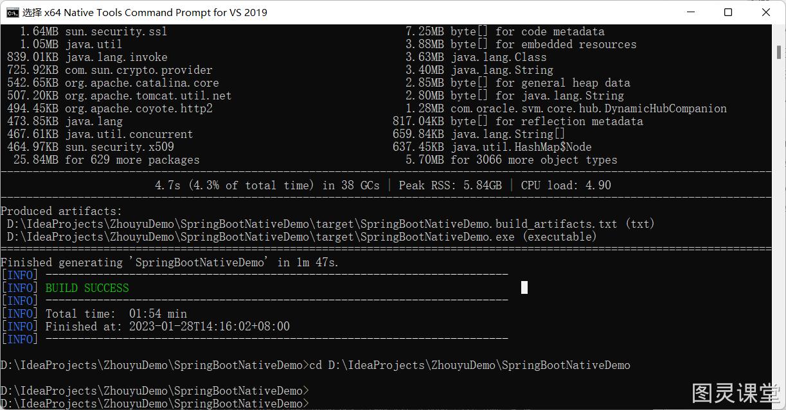


这样，我们就能够直接运行这个exe来启动我们的SpringBoot项目了。


## Docker SpringBoot3.0 实战
我们可以直接把SpringBoot应用对应的本地可执行文件构建为一个Docker镜像，这样就能跨操作系统运行了。

> Buildpacks，类似Dockerfile的镜像构建技术

> 注意要安装docker，并启动docker

> 注意这种方式并不要求你机器上安装了GraalVM，会由SpringBoot插件利用/paketo-buildpacks/native-image来生成本地可执行文件，然后打入到容器中


Docker镜像名字中不能有大写字母，我们可以配置镜像的名字：
```xml
<properties>
  <maven.compiler.source>17</maven.compiler.source>
  <maven.compiler.target>17</maven.compiler.target>
  <project.build.sourceEncoding>UTF-8</project.build.sourceEncoding>
  <spring-boot.build-image.imageName>springboot3demo</spring-boot.build-image.imageName>
</properties>
```

然后执行：
```xml
mvn -Pnative spring-boot:build-image
```
来生成Docker镜像，成功截图：
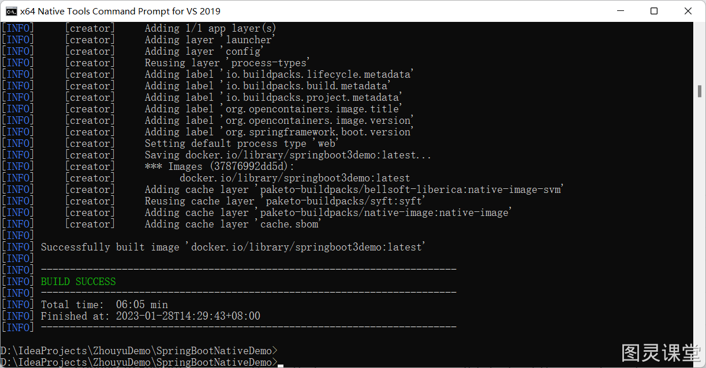

执行完之后，就能看到docker镜像了：


然后就可以运行容器了：
```xml
docker run --rm -p 8080:8080 springboot3demo
```

如果要传参数，可以通过-e
```java
docker run --rm -p 8080:8080 -e methodName=test springboot3demo
```
不过代码中，得通过以下代码获取：
```java
String methodName = System.getenv("methodName")
```

建议工作中直接使用Environment来获取参数：
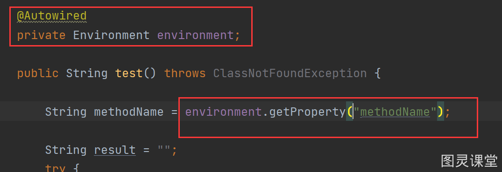


## RuntimeHints
假如应用中有如下代码：
```java
/**
* 作者：周瑜大都督
*/
public class ZhouyuService {

    public String test(){
        return "zhouyu";
    }
}
```

```java
@Component
public class UserService {

    public String test(){

        String result = "";
        try {
            Method test = ZhouyuService.class.getMethod("test", null);
            result = (String) test.invoke(ZhouyuService.class.newInstance(), null);
        } catch (NoSuchMethodException e) {
            throw new RuntimeException(e);
        } catch (InvocationTargetException e) {
            throw new RuntimeException(e);
        } catch (IllegalAccessException e) {
            throw new RuntimeException(e);
        } catch (InstantiationException e) {
            throw new RuntimeException(e);
        }

        return result;
    }

}
```

在UserService中，通过反射的方式使用到了ZhouyuService的无参构造方法（ZhouyuService.class.newInstance()），如果我们不做任何处理，那么打成二进制可执行文件后是运行不了的，可执行文件中是没有ZhouyuService的无参构造方法的，会报如下错误：
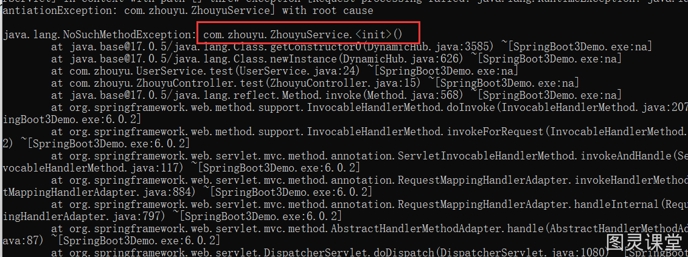

我们可以通过Spring提供的Runtime Hints机制来间接的配置reflect-config.json。


#### 方式一：RuntimeHintsRegistrar

提供一个RuntimeHintsRegistrar接口的实现类，并导入到Spring容器中就可以了：
```java
@Component
@ImportRuntimeHints(UserService.ZhouyuServiceRuntimeHints.class)
public class UserService {

    public String test(){

        String result = "";
        try {
            Method test = ZhouyuService.class.getMethod("test", null);
            result = (String) test.invoke(ZhouyuService.class.newInstance(), null);
        } catch (NoSuchMethodException e) {
            throw new RuntimeException(e);
        } catch (InvocationTargetException e) {
            throw new RuntimeException(e);
        } catch (IllegalAccessException e) {
            throw new RuntimeException(e);
        } catch (InstantiationException e) {
            throw new RuntimeException(e);
        }


        return result;
    }

    static class ZhouyuServiceRuntimeHints implements RuntimeHintsRegistrar {

        @Override
        public void registerHints(RuntimeHints hints, ClassLoader classLoader) {
            try {
                hints.reflection().registerConstructor(ZhouyuService.class.getConstructor(), ExecutableMode.INVOKE);
            } catch (NoSuchMethodException e) {
                throw new RuntimeException(e);
            }
        }
    }
}
```


#### 方式二：@RegisterReflectionForBinding
```java
@RegisterReflectionForBinding(ZhouyuService.class)
public String test(){

    String result = "";
    try {
        Method test = ZhouyuService.class.getMethod("test", null);
        result = (String) test.invoke(ZhouyuService.class.newInstance(), null);
    } catch (NoSuchMethodException e) {
        throw new RuntimeException(e);
    } catch (InvocationTargetException e) {
        throw new RuntimeException(e);
    } catch (IllegalAccessException e) {
        throw new RuntimeException(e);
    } catch (InstantiationException e) {
        throw new RuntimeException(e);
    }


    return result;
}
```

**注意**
如果代码中的methodName是通过参数获取的，那么GraalVM在编译时就不能知道到底会使用到哪个方法，那么test方法也要利用RuntimeHints来进行配置。

```java
@Component
@ImportRuntimeHints(UserService.ZhouyuServiceRuntimeHints.class)
public class UserService {

    public String test(){

        String methodName = System.getProperty("methodName");

        String result = "";
        try {
            Method test = ZhouyuService.class.getMethod(methodName, null);
            result = (String) test.invoke(ZhouyuService.class.newInstance(), null);
        } catch (NoSuchMethodException e) {
            throw new RuntimeException(e);
        } catch (InvocationTargetException e) {
            throw new RuntimeException(e);
        } catch (IllegalAccessException e) {
            throw new RuntimeException(e);
        } catch (InstantiationException e) {
            throw new RuntimeException(e);
        }


        return result;
    }

    static class ZhouyuServiceRuntimeHints implements RuntimeHintsRegistrar {

        @Override
        public void registerHints(RuntimeHints hints, ClassLoader classLoader) {
            try {
                hints.reflection().registerConstructor(ZhouyuService.class.getConstructor(), ExecutableMode.INVOKE);
                hints.reflection().registerMethod(ZhouyuService.class.getMethod("test"), ExecutableMode.INVOKE);
            } catch (NoSuchMethodException e) {
                throw new RuntimeException(e);
            }
        }
    }
}
```

或者使用了JDK动态代理：
```java
public String test() throws ClassNotFoundException {

    String className = System.getProperty("className");
	Class<?> aClass = Class.forName(className);

	Object o = Proxy.newProxyInstance(UserService.class.getClassLoader(), new Class[]{aClass}, new InvocationHandler() {
    	@Override
    	public Object invoke(Object proxy, Method method, Object[] args) throws Throwable {
        	return method.getName();
    	}
	});

	return o.toString();
}
```
那么也可以利用RuntimeHints来进行配置要代理的接口：
```java
public void registerHints(RuntimeHints hints, ClassLoader classLoader) {
    hints.proxies().registerJdkProxy(UserInterface.class);
}
```


#### 方式三：@Reflective
对于反射用到的地方，我们可以直接加一个@Reflective，前提是ZhouyuService得是一个Bean：
```java
@Component
public class ZhouyuService {

    @Reflective
    public ZhouyuService() {
    }

    @Reflective
    public String test(){
        return "zhouyu";
    }
}
```

以上Spring6提供的RuntimeHints机制，我们可以使用该机制更方便的告诉GraalVM我们额外用到了哪些类、接口、方法等信息，最终Spring会生成对应的reflect-config.json、proxy-config.json中的内容，GraalVM就知道了。

## Spring AOT的源码实现
流程图：[https://www.processon.com/view/link/63edeea8440e433d3d6a88b2](https://www.processon.com/view/link/63edeea8440e433d3d6a88b2)


### SpringBoot 3.0插件实现原理
上面的SpringBoot3.0实战过程中，我们在利用image-native编译的时候，target目录下会生成一个spring-aot文件夹：
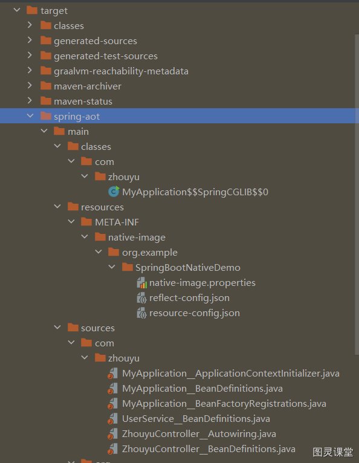

这个spring-aot文件夹是编译的时候spring boot3.0的插件生成的，resources/META-INF/native-image文件夹中的存放的就是graalvm的配置文件。

当我们执行`mvn -Pnative native:compile`时，实际上执行的是插件native-maven-plugin的逻辑。
我们可以执行`mvn help:describe -Dplugin=org.graalvm.buildtools:native-maven-plugin -Ddetail`
来查看这个插件的详细信息。
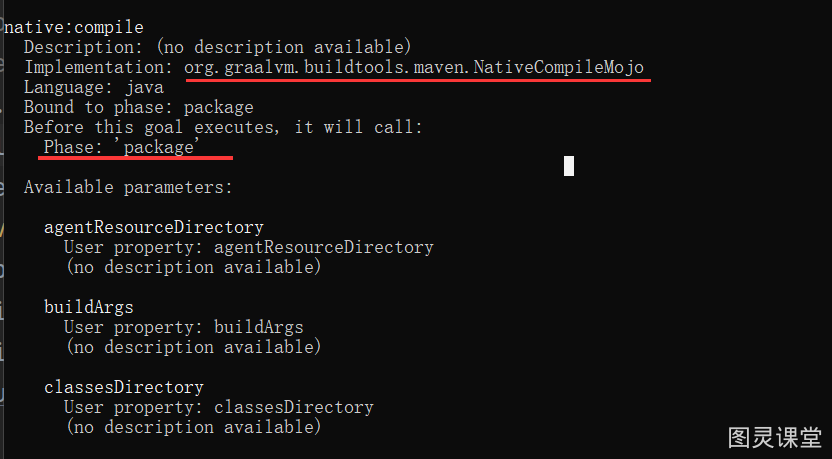

发现native:compile命令对应的实现类为NativeCompileMojo，并且会先执行package这个命令，从而会执行process-aot命令，因为spring-boot-maven-plugin插件中有如下配置：
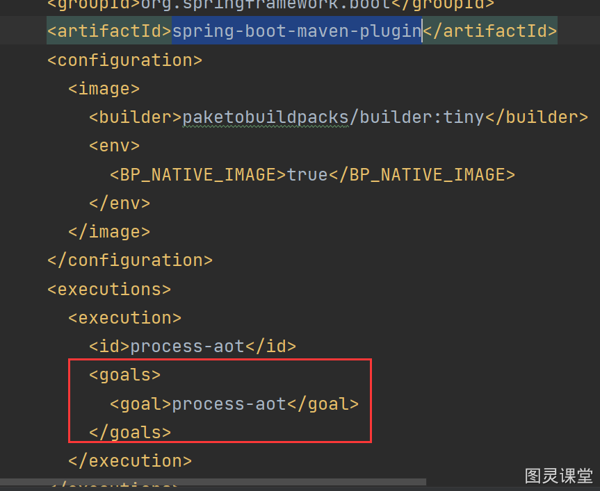

我们可以执行`mvn help:describe -Dplugin=org.springframework.boot:spring-boot-maven-plugin -Ddetail`


发现对应的phase为：prepare-package，所以会在打包之前执行ProcessAotMojo。

所以，我们在运行`mvn -Pnative native:compile`时，会先编译我们自己的java代码，然后执行executeAot()方法（会生成一些Java文件并编译成class文件，以及GraalVM的配置文件），然后才执行利用GraalVM打包出二进制可执行文件。

对应的源码实现：


maven插件在编译的时候，就会调用到executeAot()这个方法，这个方法会：

1. 先执行org.springframework.boot.SpringApplicationAotProcessor的main方法
2. 从而执行SpringApplicationAotProcessor的process()
3. 从而执行ContextAotProcessor的doProcess()，从而会生成**一些Java类**并放在spring-aot/main/sources目录下，详情看后文
4. 然后把生成在spring-aot/main/sources目录下的Java类进行编译，并把对应class文件放在项目的编译目录下target/classes
5. 然后把spring-aot/main/resources目录下的graalvm配置文件复制到target/classes
6. 然后把spring-aot/main/classes目录下生成的class文件复制到target/classes


### Spring AOT核心原理
**以下只是一些关键源码，详细内容请看直播视频。**


prepareApplicationContext会直接启动我们的SpringBoot，并在触发contextLoaded事件后，返回所创建的Spring对象，注意此时还没有扫描Bean。

```java
protected ClassName performAotProcessing(GenericApplicationContext applicationContext) {
	FileSystemGeneratedFiles generatedFiles = createFileSystemGeneratedFiles();

	DefaultGenerationContext generationContext = new DefaultGenerationContext(createClassNameGenerator(), generatedFiles);
	
	ApplicationContextAotGenerator generator = new ApplicationContextAotGenerator();

	// 会进行扫描，并且根据扫描得到的BeanDefinition生成对应的Xx_BeanDefinitions.java文件
	// 并返回com.zhouyu.MyApplication__ApplicationContextInitializer
	ClassName generatedInitializerClassName = generator.processAheadOfTime(applicationContext, generationContext);

	// 因为后续要通过反射调用com.zhouyu.MyApplication__ApplicationContextInitializer的构造方法
    // 所以将相关信息添加到reflect-config.json对应的RuntimeHints中去
	registerEntryPointHint(generationContext, generatedInitializerClassName);

	// 生成source目录下的Java文件
	generationContext.writeGeneratedContent();

	// 将RuntimeHints中的内容写入resource目录下的Graalvm的各个配置文件中
	writeHints(generationContext.getRuntimeHints());
	writeNativeImageProperties(getDefaultNativeImageArguments(getApplicationClass().getName()));

	return generatedInitializerClassName;
}
```


```java
public ClassName processAheadOfTime(GenericApplicationContext applicationContext,
									GenerationContext generationContext) {
	return withCglibClassHandler(new CglibClassHandler(generationContext), () -> {
		
		// 会进行扫描，并找到beanType是代理类的请求，把代理类信息设置到RuntimeHints中
		applicationContext.refreshForAotProcessing(generationContext.getRuntimeHints());

		// 拿出Bean工厂，扫描得到的BeanDefinition对象在里面
		DefaultListableBeanFactory beanFactory = applicationContext.getDefaultListableBeanFactory();
		
		ApplicationContextInitializationCodeGenerator codeGenerator =
			new ApplicationContextInitializationCodeGenerator(generationContext);
		
		// 核心
		new BeanFactoryInitializationAotContributions(beanFactory).applyTo(generationContext, codeGenerator);
		
		return codeGenerator.getGeneratedClass().getName();
	});
}
```

```java
BeanFactoryInitializationAotContributions(DefaultListableBeanFactory beanFactory) {
	// 把aot.factories文件的加载器以及BeanFactory，封装成为一个Loader对象，然后传入
	this(beanFactory, AotServices.factoriesAndBeans(beanFactory));
}
```

```java
BeanFactoryInitializationAotContributions(DefaultListableBeanFactory beanFactory,
										  AotServices.Loader loader) {

	// getProcessors()中会从aot.factories以及beanfactory中拿出BeanFactoryInitializationAotProcessor类型的Bean对象
	// 同时还会添加一个RuntimeHintsBeanFactoryInitializationAotProcessor
	this.contributions = getContributions(beanFactory, getProcessors(loader));
}
```

```java
private List<BeanFactoryInitializationAotContribution> getContributions(
	DefaultListableBeanFactory beanFactory,
	List<BeanFactoryInitializationAotProcessor> processors) {
	
	List<BeanFactoryInitializationAotContribution> contributions = new ArrayList<>();

	// 逐个调用BeanFactoryInitializationAotProcessor的processAheadOfTime()开始处理
	for (BeanFactoryInitializationAotProcessor processor : processors) {
		BeanFactoryInitializationAotContribution contribution = processor.processAheadOfTime(beanFactory);
		if (contribution != null) {
			contributions.add(contribution);
		}
	}
	return Collections.unmodifiableList(contributions);
}
```

总结一下，在SpringBoot项目编译时，最终会通过BeanFactoryInitializationAotProcessor来生成Java文件，或者设置RuntimeHints，后续会把写入Java文件到磁盘，将RuntimeHints中的内容写入GraalVM的配置文件，再后面会编译Java文件，再后面就会基于生成出来的GraalVM配置文件打包出二进制可执行文件了。

所以我们要看Java文件怎么生成的，RuntimeHints如何收集的就看具体的BeanFactoryInitializationAotProcessor就行了。

比如:

1. 有一个BeanRegistrationsAotProcessor，它就会负责生成Xx_BeanDefinition.java以及Xx__ApplicationContextInitializer.java、Xx__BeanFactoryRegistrations.java中的内容
2. 还有一个RuntimeHintsBeanFactoryInitializationAotProcessor，它负责从aot.factories文件以及BeanFactory中获取RuntimeHintsRegistrar类型的对象，以及会找到@ImportRuntimeHints所导入的RuntimeHintsRegistrar对象，最终就是从这些RuntimeHintsRegistrar中设置RuntimeHints。


### Spring Boot3.0启动流程
在run()方法中，SpringBoot会创建一个Spring容器，但是SpringBoot3.0中创建容器逻辑为：
```java
private ConfigurableApplicationContext createContext() {
	if (!AotDetector.useGeneratedArtifacts()) {
		return new AnnotationConfigServletWebServerApplicationContext();
	}
	return new ServletWebServerApplicationContext();
}
```
如果没有使用AOT，那么就会创建AnnotationConfigServletWebServerApplicationContext，它里面会添加ConfigurationClassPostProcessor，从而会解析配置类，从而会扫描。

而如果使用了AOT，则会创建ServletWebServerApplicationContext，它就是一个空容器，它里面没有ConfigurationClassPostProcessor，所以后续不会触发扫描了。

创建完容器后，就会找到MyApplication__ApplicationContextInitializer，开始向容器中注册BeanDefinition。

后续就是创建Bean对象了。


> 原文: <https://www.yuque.com/tulingzhouyu/db22bv/xuggztenwamomqyg>