# Netty篇

核心组件

**1、整体结构**
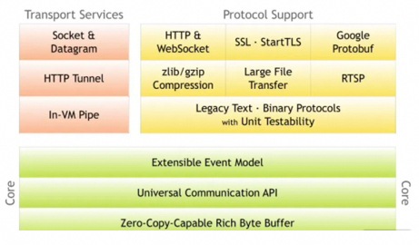
Core 核心层
Core 核心层是 Netty 最精华的内容，它提供了底层网络通信的通用抽象和实现，包括事件模型、通用API、支持零拷贝的 ByteBuf 等。
Protocol Support 协议支持层
协议支持层基本上覆盖了主流协议的编解码实现，如 HTTP、Protobuf、WebSocket、二进制等主流协议，此外 Netty 还支持自定义应用层协议。Netty 丰富的协议支持降低了用户的开发成本，基于 Netty 我们可以快速开发 HTTP、WebSocket 等服务。
Transport Service 传输服务层
传输服务层提供了网络传输能力的定义和实现方法。它支持 Socket、HTTP 隧道、虚拟机管道等传输方式。Netty 对 TCP、UDP 等数据传输做了抽象和封装，用户可以更聚焦在业务逻辑实现上，而不必关系底层数据传输的细节。

**2、逻辑架构**
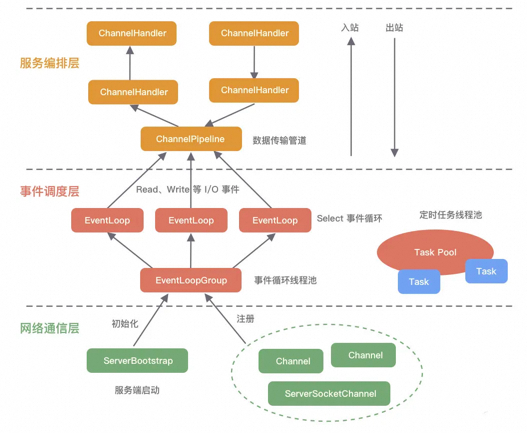
网络通信层
网络通信层的职责是执行网络 I/O 的操作。它支持多种网络协议和 I/O 模型的连接操作。当网络数据读取到内核缓冲区后，会触发各种网络事件，这些网络事件会分发给事件调度层进行处理。
网络通信层的核心组件包含**BootStrap、ServerBootStrap、Channel**三个组件。
Bootstrap 是“引导”的意思，负责 Netty **客户端程序**的启动、初始化、服务器连接等过程，串联了 Netty 的其他核心组件。
ServerBootStrap 用于**服务端启动**绑定本地端口，会绑定Boss 和 Worker两个 EventLoopGroup。
Channel 的是“**通道**”，Netty Channel提供了基于NIO更高层次的抽象，如 register、bind、connect、read、write、flush 等。
事件调度层
事件调度层的职责是通过 Reactor 线程模型对各类事件进行聚合处理，通过 Selector 主循环线程集成多种事件（ I/O 事件、信号事件、定时事件等），实际的业务处理逻辑是交由服务编排层中相关的 Handler 完成。
事件调度层的核心组件包括 **EventLoopGroup、EventLoop**。
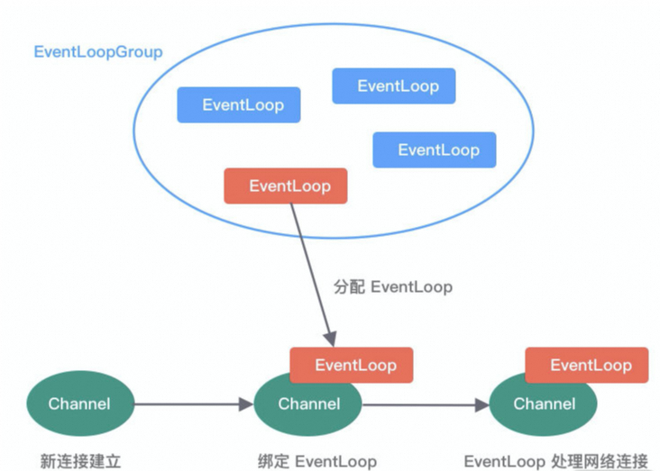
**EventLoop** 负责处理 Channel 生命周期内的所有 I/O 事件，如 accept、connect、read、write 等 I/O 事件
①一个 EventLoopGroup 往往包含**一个或者多个** EventLoop。
②EventLoop 同一时间会与一个Channel绑定，每个 EventLoop 负责**处理一种类型 Channel**。
③Channel 在生命周期内可以对和多个 EventLoop 进行**多次绑定和解绑**。 
**EventLoopGroup** 是Netty 的**核心处理引擎**，本质是一个线程池，主要负责接收 I/O 请求，并分配线程执行处理请求。通过创建不同的 EventLoopGroup 参数配置，就可以支持 Reactor 的三种线程模型：
**单线程模型：**EventLoopGroup 只包含一个 EventLoop，Boss 和 Worker 使用同一个EventLoopGroup；
**多线程模型：**EventLoopGroup 包含多个 EventLoop，Boss 和 Worker 使用同一个EventLoopGroup；
**主从多线程模型：**EventLoopGroup 包含多个 EventLoop，Boss 是主 Reactor，Worker 是从 Reactor，它们分别使用不同的 EventLoopGroup，主 Reactor 负责新的网络连接 Channel 创建，然后把 Channel 注册到从 Reactor。
服务编排层
服务编排层的职责是负责组装各类服务，它是 Netty 的核心处理链，用以实现网络事件的动态编排和有序传播。
服务编排层的核心组件包括 **ChannelPipeline、ChannelHandler、ChannelHandlerContext**。
**ChannelPipeline** 是 Netty 的核心编排组件，负责组装各种 ChannelHandler，ChannelPipeline 内部通过双向链表将不同的 ChannelHandler 链接在一起。当 I/O 读写事件触发时，Pipeline 会依次调用 Handler 列表对 Channel 的数据进行拦截和处理。

客户端和服务端都有各自的 ChannelPipeline。客户端和服务端一次完整的请求：客户端出站（Encoder 请求数据）、服务端入站（Decoder接收数据并执行业务逻辑）、服务端出站（Encoder响应结果）。
**ChannelHandler** 完成数据的编解码以及处理工作。

**ChannelHandlerContext** 用于保存Handler 上下文，通过 HandlerContext 我们可以知道 Pipeline 和 Handler 的关联关系。HandlerContext 可以实现 Handler 之间的交互，HandlerContext 包含了 Handler 生命周期的所有事件，如 connect、bind、read、flush、write、close 等。同时，HandlerContext 实现了Handler通用的逻辑的模型抽象。
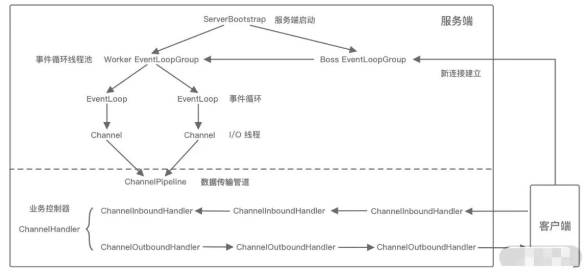
网络传输

**1、五种IO模型的区别**
阻塞I/O：（BIO）
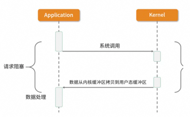
应用进程向内核发起 I/O 请求，发起调用的线程一直等待内核返回结果。一次完整的 I/O 请求称为BIO（Blocking IO，阻塞 I/O），所以 BIO 在实现异步操作时，只能使用多线程模型，一个请求对应一个线程。但是，**线程的资源是有限且宝贵的，创建过多的线程会增加线程切换的开销。**
同步非阻塞I/O（NIO）：

应用进程向内核发起 I/O 请求后不再会同步等待结果，而是会立即返回，通过轮询的方式获取请求结果。NIO 相比 BIO 虽然大幅提升了性能，但是轮询过程中大量的系统调用导致上下文切换开销很大。所以，单独使用非阻塞 I/O 时效率并不高，而且**随着并发量的提升，非阻塞 I/O 会存在严重的性能浪费。**
多路复用I/O（select和poll）：

多路复用实现了**一个线程处理多个 I/O 句柄的操作**。多路指的是多个数据通道，复用指的是使用一个或多个固定线程来处理每一个 Socket。select、poll、epoll 都是 I/O 多路复用的具体实现，线程一次 select 调用可以获取内核态中多个数据通道的数据状态。其中，select只负责等，recvfrom只负责拷贝，阻塞IO中可以对多个文件描述符进行阻塞监听，是一种非常高效的 I/O 模型。
信号驱动I/O（SIGIO）：

信号驱动IO模型，应用进程告诉内核：当数据报准备好的时候，给我发送一个信号，对SIGIO信号进行捕捉，并且调用我的信号处理函数来获取数据报。
异步I/O（Posix.1的aio_系列函数）：

当应用程序调用aio_read时，内核一方面去取数据报内容返回，另一方面将程序控制权还给应用进程，应用进程继续处理其他事情，是一种非阻塞的状态。当内核中有数据报就绪时，由内核将数据报拷贝到应用程序中，返回aio_read中定义好的函数处理程序。

**2、Reactor多线程模型**
Netty 的 I/O 模型是基于非阻塞 I/O 实现的，底层依赖的是 NIO 框架的多路复用器 Selector。采用 epoll 模式后，只需要一个线程负责 Selector 的轮询。当有数据处于就绪状态后，需要一个事件分发器（Event Dispather），它负责将读写事件分发给对应的读写事件处理器（Event Handler）。事件分发器有两种设计模式：Reactor 和 Proactor，Reactor 采用同步 I/O， Proactor 采用异步 I/O。
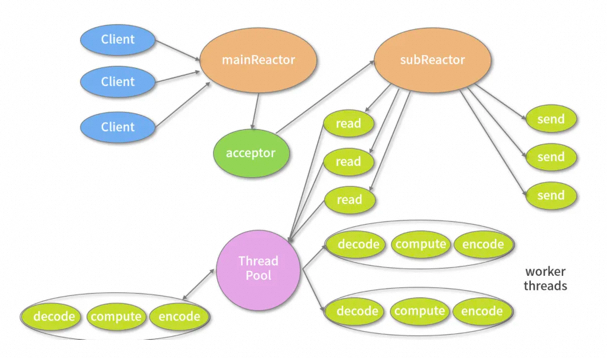
Reactor 实现相对简单，适合处理耗时短的场景，对于耗时长的 I/O 操作容易造成阻塞。Proactor 性能更高，但是实现逻辑非常复杂，适合图片或视频流分析服务器，目前主流的事件驱动模型还是依赖 select 或 epoll 来实现。

**3、拆包粘包问题**
拆包TCP 传输协议是面向流的，没有数据包界限。
**MTU（Maxitum Transmission Unit） **是链路层一次最大传输数据的大小。MTU 一般来说大小为 1500 byte。
**MSS（Maximum Segement Size）** 是指 TCP 最大报文段长度，它是传输层一次发送最大数据的大小。

如上图所示，如果 MSS + TCP 首部 + IP 首部 > MTU，那么数据包将会被拆分为多个发送。这就是拆包现象。
Nagle 算法
Nagle 算法可以理解为批量发送，也是我们平时编程中经常用到的优化思路，它是在数据未得到确认之前先写入缓冲区，等待数据确认或者缓冲区积攒到一定大小再把数据包发送出去。Netty 中为了使数据传输延迟最小化，就默认**禁用了 Nagle 算法**。
拆包/粘包的解决方案
在客户端和服务端通信的过程中，服务端一次读到的数据大小是不确定的。需要确定边界：
消息长度固定
特定分隔符
消息长度 + 消息内容(Netty)

**4、自定义协议**
Netty 常用编码器类型：

```
MessageToByteEncoder //对象编码成字节流；
MessageToMessageEncoder //一种消息类型编码成另外一种消息类型。
```
Netty 常用解码器类型：

```
ByteToMessageDecoder/ReplayingDecoder //将字节流解码为消息对象；
MessageToMessageDecoder //将一种消息类型解码为另外一种消息类型。
```
编解码器可以分为**一次解码器**和**二次解码器**，一次解码器用于解决 **TCP 拆包/粘包问题**，按协议解析后得到的字节数据。如果你需要对解析后的**字节数据做对象模型**的转换，这时候便需要用到二次解码器，同理编码器的过程是反过来的。
**Netty自定义协议内容：**
```
/*+---------------------------------------------------------------+| 魔数 2byte | 协议版本号 1byte | 序列化算法 1byte | 报文类型 1byte  |+---------------------------------------------------------------+| 状态 1byte |        保留字段 4byte     |      数据长度 4byte     | +---------------------------------------------------------------+|                   数据内容 （长度不定）                          |+---------------------------------------------------------------+ */
```
如何判断 ByteBuf 是否存在完整的报文？最常用的做法就是通过读取消息长度 dataLength 进行判断。如果 ByteBuf 的可读数据长度小于 dataLength，说明 ByteBuf 还不够获取一个完整的报文。

**5、WriteAndFlush**
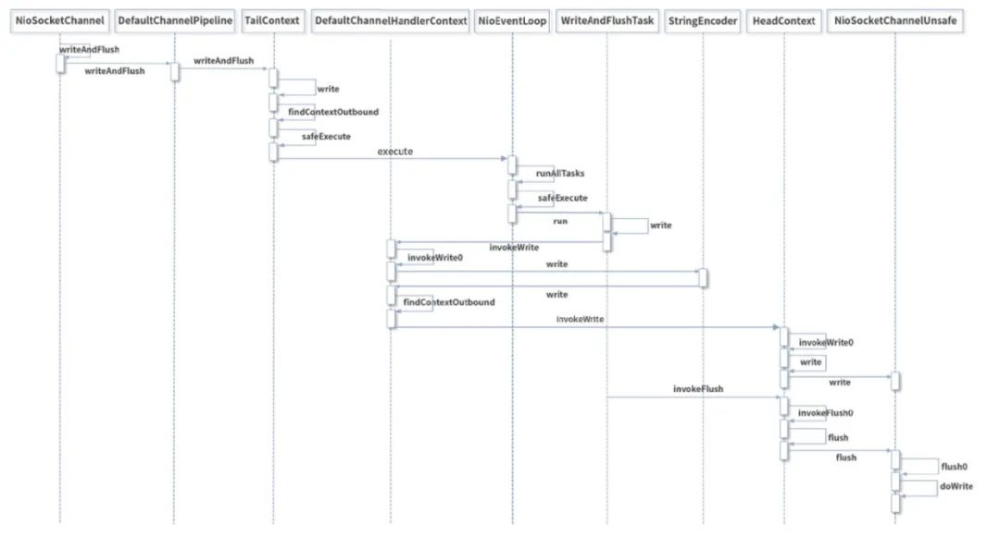
①writeAndFlush 属于出站操作，它是从 Pipeline 的 Tail 节点开始进行事件传播，一直向前传播到 Head 节点。不管在 write 还是 flush 过程，Head 节点都中扮演着重要的角色。
②write 方法并没有将数据写入 Socket 缓冲区，只是将数据写入到 ChannelOutboundBuffer 缓存中，ChannelOutboundBuffer 缓存内部是由单向链表实现的。
③flush 方法才最终将数据写入到 Socket 缓冲区。
内存管理

**1、堆外内存**
在 Java 中对象都是在堆内分配的，通常我们说的J**VM 内存**也就指的**堆内内存**，**堆内内存**完全被**JVM 虚拟机**所管理，JVM 有自己的垃圾回收算法，对于使用者来说不必关心对象的内存如何回收。**堆外内存**与堆内内存相对应，对于整个机器内存而言，除**堆内内存以外部分即为堆外内存**。堆外内存不受 JVM 虚拟机管理，直接由操作系统管理。使用堆外内存有如下几个优点：

1. 堆内内存由 JVM GC 自动回收内存，降低了 Java 用户的使用心智，堆外内存由于不受 JVM 管理，所以在一定程度上可以降低 GC 对应用运行时带来的影响。
2. 堆外内存需要手动释放，这一点跟 C/C++ 很像，稍有不慎就会造成应用程序内存泄漏，当出现内存泄漏问题时排查起来会相对困难。
3. 当进行网络 I/O 操作、文件读写时，堆内内存都需要转换为堆外内存，然后再与底层设备进行交互，所以直接使用堆外内存可以减少一次内存拷贝。
4. 堆外内存可以方便实现进程之间、JVM 多实例之间的数据共享。

在堆内存放的 DirectByteBuffer 对象并不大，仅仅包含堆外内存的地址、大小等属性，同时还会创建对应的 Cleaner 对象，通过 ByteBuffer 分配的堆外内存不需要手动回收，它可以被 JVM 自动回收。当堆内的 DirectByteBuffer 对象被 GC 回收时，Cleaner 就会用于回收对应的堆外内存。

从 DirectByteBuffer 的构造函数中可以看出，真正分配堆外内存的逻辑还是通过 unsafe.allocateMemory(size)，Unsafe 是一个非常不安全的类，它用于执行内存访问、分配、修改等**敏感操作**，可以越过 JVM 限制的枷锁。Unsafe 最初并不是为开发者设计的，使用它时虽然可以获取对底层资源的控制权，但也失去了安全性的保证，使用 Unsafe 一定要慎重（Java 中是不能直接使用 Unsafe 的，但是可以通过反射获取 Unsafe 实例）。Netty 中依赖了 Unsafe 工具类，是因为 Netty 需要与底层 Socket 进行交互，Unsafe 提升 Netty 的性能
因为DirectByteBuffer 对象的回收需要依赖 Old GC 或者 Full GC 才能触发清理，如果长时间没有 GC执行，那么堆外内存即使不再使用，也会一直在占用内存不释放，很容易将机器的物理内存耗尽。-XX:MaxDirectMemorySize 指定堆外内存的上限大小，超出时触发GC，仍无法释放抛出OOM异常。

当初始化堆外内存时，内存中的对象引用情况如下图所示，first 是 Cleaner 类中的静态变量，Cleaner 对象在初始化时会加入 Cleaner 链表中。DirectByteBuffer 对象包含堆外内存的地址、大小以及 Cleaner 对象的引用，ReferenceQueue 用于保存需要回收的 Cleaner 对象。

**2、数据载体ByteBuf**
JDK NIO 的 **ByteBuffer**

- mark：为某个读取过的关键位置做标记，方便回退到该位置；
- position：当前读取的位置；
- limit：buffer 中有效的数据长度大小；
- capacity：初始化时的空间容量。


第一，ByteBuffer 分配的长度是固定的，无法动态扩缩容，每次在存放数据的时候对容量大小做校验，扩容需要将已有的数据迁移。
第二，ByteBuffer 只能通过 position 获取当前可操作的位置，因为读写共用的 position 指针，所以需要频繁调用 flip、rewind 方法切换读写状态。
Netty中的ByteBuf

- **废弃字节**，表示已经丢弃的无效字节数据。
- **可读字节**，表示 ByteBuf 中可以被读取的字节内容，可以通过 writeIndex - readerIndex 计算得出。当读写位置重叠时时，表示 ByteBuf 已经不可读。
- **可写字节**，向 ByteBuf 中写入数据都会存储到可写字节区域。当 writeIndex 超过 capacity，表示 ByteBuf 容量不足，需要扩容。
- **可扩容字节**，表示 ByteBuf 最多还可以扩容多少字节，最多扩容到 maxCapacity 为止，超过 maxCapacity 再写入就会出错。


引用计数
当byteBuf当引用计数为 0，该 ByteBuf 可以被放入到对象池中，避免每次使用 ByteBuf 都重复创建。
JVM 并不知道 Netty 的引用计数是如何实现的，当 ByteBuf 对象不可达时，一样会被 GC 回收掉，但是如果此时 ByteBuf 的引用计数不为 0，那么该对象就不会释放或者被放入对象池，从而发生了内存泄漏。Netty 会对分配的 ByteBuf 进行抽样分析，检测 ByteBuf 是否已经不可达且引用计数大于 0，判定内存泄漏的位置并输出到日志中，**通过关注日志中 LEAK 关键字可以找到内存泄漏的具体对象。**

**3、内存分配jemalloc**
为了减少分配时产生的内部碎片和外部碎片，常见的内存分配算法**动态内存分配**、**伙伴算法**和**Slab 算法**
动态内存分配（DMA）
**⾸次适应算法（first fit）**，空闲分区链以地址递增的顺序将空闲分区以双向链表的形式连接在一起，从空闲分区链中找到第一个满足分配条件的空闲分区，然后从空闲分区中划分出一块可用内存给请求进程，剩余的空闲分区仍然保留在空闲分区链中。
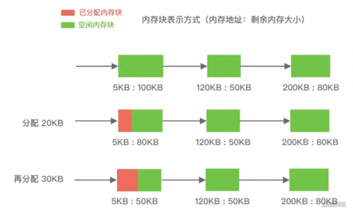
**循环首次适应算法（next fit）**不再是每次从链表的开始进行查找，而是从上次找到的空闲分区的以后开始查找。查找效率提升，会产生更多的碎片。
**最佳适应算法（best fit）**，空闲分区链以空闲分区大小递增的顺序将空闲分区以双向链表的形式连接在一起，每次从空闲分区链的开头进行查找。
**伙伴算法**（外部碎片少，内部碎片多）
是一种非常经典的内存分配算法，它采用了**分离适配的设计思想**，将物理内存按照 2 的次幂进行划分，内存分配时也是按照 2 的次幂大小进行按需分配
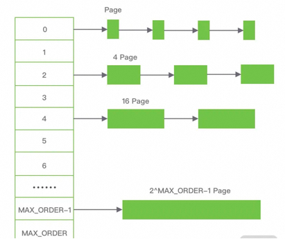

1. 首先需要找到存储 2^4 连续 Page 所对应的链表，即数组下标为 4；
2. 查找 2^4 链表中是否有空闲的内存块，如果有则分配成功；
3. 如果 2^4 链表不存在空闲的内存块，则继续沿数组向上查找，即定位到数组下标为 5 的链表，链表中每个节点存储 2^5 的连续 Page；
4. 如果 2^5 链表中存在空闲的内存块，则取出该内存块并将它分割为 2 个 2^4 大小的内存块，其中一块分配给进程使用，剩余的一块链接到 2^4 链表中。

Slab 算法（解决伙伴算法内部碎片问题）
Slab 算法在伙伴算法的基础上，对小内存的场景专门做了优化，采用了内存池的方案，解决内部碎片问题。

在 Slab 算法中维护着大小不同的 Slab 集合，将这块内存划分为大小相同的 slot，不会对内存块再进行合并，同时使用位图 bitmap 记录每个 slot 的使用情况。
kmem_cache 中包含三个 Slab 链表：**完全分配使用 slab_full**、**部分分配使用 slab_partial**和**完全空闲 slabs_empty**，这三个链表负责内存的分配和释放。Slab 算法是基于对象进行内存管理的，它把相同类型的对象分为一类。当分配内存时，从 Slab 链表中划分相应的内存单元；单个 Slab 可以在不同的链表之间移动，例如当一个 Slab 被分配完，就会从 slab_partial 移动到 slabs_full，当一个 Slab 中有对象被释放后，就会从 slab_full 再次回到 slab_partial，所有对象都被释放完的话，就会从 slab_partial 移动到 slab_empty。当**释放内存时，Slab 算法并不会丢弃已经分配的对象，而是将它保存在缓存中，当下次再为对象分配内存时，直接会使用最近释放的内存块。**

**4、jemalloc 架构**

- 内存是由一定数量的 arenas 负责管理，线程均匀分布在 arenas 当中；
- 每个 arena 都包含一个 bin 数组，每个 bin 管理不同档位的内存块；
- 每个 arena 被划分为若干个 chunks，每个 chunk 又包含若干个 runs，每个 run 由连续的 Page 组成，run 才是实际分配内存的操作对象；
- 每个 run 会被划分为一定数量的 regions，在小内存的分配场景，region 相当于用户内存；
- 每个 tcache 对应一个 arena，tcache 中包含多种类型的 bin。

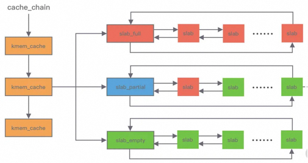
**内存管理Arena** ，内存由一定数量的 arenas 负责管理。每个用户线程采用 round-robin 轮询的方式选择可用的 arena 进行内存分配。
**分级管理Bin**，每个 bin 管理的内存大小是按分类依次递增。jemalloc 中小内存的分配是基于 Slab 算法完成的，会产生不同类别的内存块。
**Page集合chunk**，chunk 以 Page 为单位管理内存。每个 chunk 可被用于多次小内存的申请，但是在大内存分配的场景下只能分配一次。
**实际分配单位run**，run 结构具体的大小由不同的 bin 决定，例如 8 字节的 bin 对应的 run 只有一个 Page，可以从中选取 8 字节的块进行分配。
**run 细分region**，每个 run 会将划分为若干个等长的 region，每次内存分配也是按照 region 进行分发。
**tcache 是每个线程私有的缓存**，tcache 每次从 arena 申请一批内存，在分配内存时首先在 tcache 查找，避免锁竞争，分配失败才会通过 run 执行内存分配。
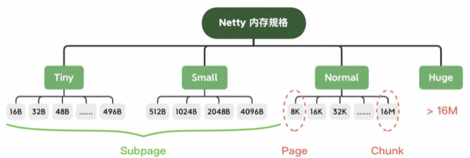
Small 场景，如果请求分配内存的大小小于 arena 中的最小的 bin，那么优先从线程中对应的 tcache 中进行分配。首先确定查找对应的 tbin 中是否存在缓存的内存块，如果存在则分配成功，否则找到 tbin 对应的 arena，从 arena 中对应的 bin 中分配 region 保存在 tbin 的 avail 数组中，最终从 availl 数组中选取一个地址进行内存分配，当内存释放时也会将被回收的内存块进行缓存。
Large 场景的内存分配与 Smalll 类似，如果请求分配内存的大小大于 arena 中的最小的 bin，但是不大于 tcache 中能够缓存的最大块，依然会通过 tcache 进行分配，但是不同的是此时会分配 chunk 以及所对应的 run，从 chunk 中找到相应的内存空间进行分配。内存释放时也跟 samll 场景类似，会把释放的内存块缓存在 tacache 的 tbin 中。此外还有一种情况，当请求分配内存的大小大于tcache 中能够缓存的最大块，但是不大于 chunk 的大小，那么将不会采用 tcache 机制，直接在 chunk 中进行内存分配。
Huge 场景，如果请求分配内存的大小大于 chunk 的大小，那么直接通过 mmap 进行分配，调用 munmap 进行回收。

**5、零拷贝技术**

1. 当用户进程发起 read() 调用后，上下文从用户态切换至内核态。DMA 引擎从文件中读取数据，并存储到内核态缓冲区，这里是**第一次数据拷贝**。
2. 请求的数据从内核态缓冲区拷贝到用户态缓冲区，然后返回给用户进程。**第二次数据拷贝**的过程同时，会导致上下文从内核态再次切换到用户态。
3. 用户进程调用 send() 方法期望将数据发送到网络中，用户态会再次切换到内核态，**第三次数据拷贝**请求的数据从用户态缓冲区被拷贝到 Socket 缓冲区。
4. 最终 send() 系统调用结束返回给用户进程，发生了第四次上下文切换。**第四次拷贝会异步执行**，从 Socket 缓冲区拷贝到协议引擎中。


**在 Linux 中**系统调用 sendfile() 可以实现将数据从一个文件描述符传输到另一个文件描述符，从而实现了零拷贝技术。
**在 Java 中**也使用了零拷贝技术，它就是 NIO FileChannel 类中的 transferTo() 方法，它可以将数据从 FileChannel 直接传输到另外一个 Channel。

**Netty 中的零拷贝**技术除了操作系统级别的功能封装，更多的是面向用户态的数据操作优化，主要体现在以下 5 个方面：

- 堆外内存，避免 JVM 堆内存到堆外内存的数据拷贝。
- CompositeByteBuf 类，可以组合多个 Buffer 对象合并成一个逻辑上的对象，避免通过传统内存拷贝的方式将几个 Buffer 合并成一个大的 Buffer。
- 通过 Unpooled.wrappedBuffer 可以将 byte 数组包装成 ByteBuf 对象，包装过程中不会产生内存拷贝。
- ByteBuf.slice ，slice 操作可以将一个 ByteBuf 对象切分成多个 ByteBuf 对象，切分过程中不会产生内存拷贝，底层共享一个 byte 数组的存储空间。
- Netty 使用 封装了transferTo() 方法 FileRegion，可以将文件缓冲区的数据直接传输到目标 Channel，避免内核缓冲区和用户态缓冲区之间的数据拷贝。

高性能数据结构

**1、FastThreadLocal**
ThreadLocal 可以理解为线程本地变量。ThreadLocal 为变量在每个线程中都创建了一个副本，该副本只能被当前线程访问，多线程之间是隔离的，变量不能在多线程之间共享。这样每个线程修改变量副本时，不会对其他线程产生影响。
既然多线程访问 ThreadLocal 变量时都会有自己独立的实例副本，那么很容易想到的方案就是在 ThreadLocal 中维护一个 Map，记录线程与实例之间的映射关系。当新增线程和销毁线程时都需要更新 Map 中的映射关系，因为会存在多线程并发修改，所以需要保证 Map 是线程安全的。但是在高并发的场景并发修改 Map 需要加锁，势必会降低性能。
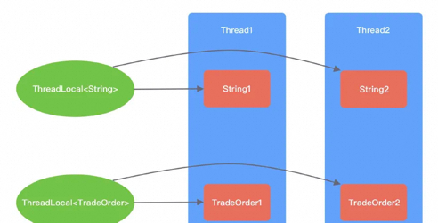
JDK 为了避免加锁，采用了相反的设计思路。以 Thread 入手，在 Thread 中维护一个 Map，记录 ThreadLocal 与实例之间的映射关系，这样在同一个线程内，Map 就不需要加锁了。

ThreadLocalMap 是一种使用线性探测法实现的哈希表，底层采用数组存储数据，通过魔数0x61c88647来使散列更加平衡。ThreadLocalMap 初始化一个长度为 16 的 Entry 数组。与 HashMap 不同的是，Entry 的 key 就是 ThreadLocal对象本身，value 就是用户具体需要存储的值。

Entry 继承自弱引用类 WeakReference，Entry 的 key 是弱引用，value 是强引用。在 JVM 垃圾回收时，只要发现了弱引用的对象，不管内存是否充足，都会被回收。那么为什么 Entry 的 key 要设计成弱引用呢？如果 key 都是强引用，当线 ThreadLocal 不再使用时，然而 ThreadLocalMap 中还是存在对 ThreadLocal 的强引用，那么 GC 是无法回收的，从而造成内存泄漏。
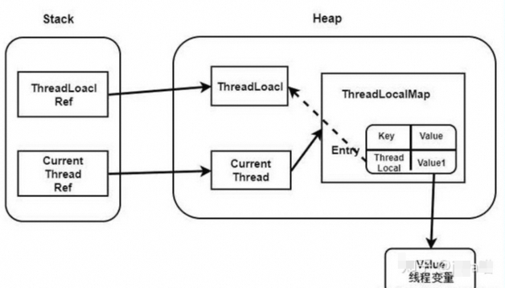
虽然 Entry 的 key 设计成了弱引用，但是当 ThreadLocal不再使用(**业务逻辑走完，但是由于线程复用导致线程并没有结束**)被 GC 回收后，ThreadLocalMap 中可能出现 Entry 的 key 为 NULL，那么 Entry 的 value 一直会强引用数据而得不到释放，只能等待线程销毁。那么应该如何避免 ThreadLocalMap 内存泄漏呢？ThreadLocal 已经帮助我们做了一定的保护措施，在执行 ThreadLocal.set()/get() 方法时，ThreadLocal 会清除 ThreadLocalMap 中 key 为 NULL 的 Entry 对象，让它还能够被 GC 回收。除此之外，当线程中某个 ThreadLocal 对象不再使用时，立即调用 remove() 方法删除 Entry 对象。如果是在异常的场景中，应在 finally 代码块中进行清理，保持良好的编码意识。在Netty中，可以方便的使用FashThreadLocal来防止内存泄漏。
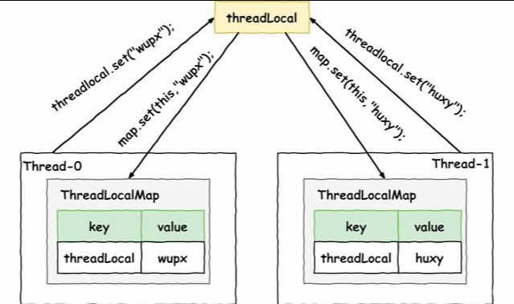
FastThreadLocal
FastThreadLocal 使用 Object 数组替代了 Entry 数组，Object[0] 存储的是一个Set<FastThreadLocal<?>> 集合，从数组下标 1 开始都是直接存储的 value 数据，不再采用 ThreadLocal 的键值对形式进行存储。主要是针对set方法，增加了两个额外的行为。

1. 找到数组下标 index 位置，设置新的 value。
2. 将 **FastThreadLocal 对象保存到待清理的 Set 中**。


- **高效查找。**FastThreadLocal 在定位数据的时候可以直接根据数组下标 index 获取，时间复杂度 O(1)。而 JDK 原生的 ThreadLocal 在数据较多时哈希表很容易发生 Hash 冲突，线性探测法在解决 Hash 冲突时需要不停地向下寻找，效率较低。此外，FastThreadLocal 相比 ThreadLocal 数据扩容更加简单高效，FastThreadLocal 以 index 为基准向上取整到 2 的次幂作为扩容后容量，然后把原数据拷贝到新数组。而 ThreadLocal 由于采用的哈希表，所以在扩容后需要再做一轮 rehash。
- **安全性更高。**JDK 原生的 ThreadLocal 使用不当可能造成内存泄漏，只能等待线程销毁。在使用线程池的场景下，ThreadLocal 只能通过主动检测的方式防止内存泄漏，从而造成了一定的开销。然而 FastThreadLocal 不仅提供了 remove() 主动清除对象的方法，而且在线程池场景中 Netty 还封装了 FastThreadLocalRunnable，**任务执行完毕后一定会执行 FastThreadLocal.removeAll() 将 Set 集合中所有 FastThreadLocal 对象都清理掉。**


**2、HashedTimerWheel**
生成月统计报表、每日得分结算、邮件定时推送
定时任务三种形式：
1、按固定周期定时执行
2、延迟一定时间后执行
3、指定某个时刻执行
定时任务的三个关键方法：
Schedule 新增任务至任务集合；
Cancel 取消某个任务；
Run 执行到期的任务
JDK自带的三种定时器：**Timer**、**DelayedQueue** 和 **ScheduledThreadPoolExecutor**
```
Timer小根堆队列，deadline 任务位于堆顶端，弹出的始终是最优先被执行的任务。Run 操作时间复杂度 O(1)，Schedule 和Cancel 操作的时间复杂度都是 O(logn)。
```
不论有多少任务被加入数组，始终由 异步线程TimerThread 负责处理。TimerThread 会定时轮询 TaskQueue 中的任务，如果堆顶的任务的 deadline 已到，那么执行任务；如果是周期性任务，执行完成后重新计算下一次任务的 deadline，并再次放入小根堆；如果是单次执行的任务，执行结束后会从 TaskQueue 中删除。

```
DelayedQueue 采用优先级队列 PriorityQueue延迟获取对象的阻塞队列。DelayQueue中的每个对象都必须实现Delayed 接口，并重写 compareTo 和 getDelay 方法。
```
DelayQueue 提供了 put() 和 take() 的阻塞方法，可以向队列中添加对象和取出对象。对象被添加到 DelayQueue 后，会根据 compareTo() 方法进行优先级排序。getDelay() 方法用于计算消息延迟的剩余时间，只有 getDelay <=0 时，该对象才能从 DelayQueue 中取出。
DelayQueue 在日常开发中最常用的场景就是实现重试机制。例如，接口调用失败或者请求超时后，可以将当前请求对象放入 DelayQueue，通过一个异步线程 take() 取出对象然后继续进行重试。如果还是请求失败，继续放回 DelayQueue。可以设置重试的最大次数以及采用指数退避算法设置对象的 deadline，如 2s、4s、8s、16s ……以此类推。DelayQueue的时间复杂度和Timer基本一致。

```
为了解决 Timer 的设计缺陷，JDK 提供了功能更加丰富的 ScheduledThreadPoolExecutor，多线程、相对时间、对异常
```
Timer 的任务调度是基于系统绝对时间的，如果系统时间不正确，可能会出现问题。
TimerTask 如果执行出现异常，Timer 并不会捕获，会导致线程终止，其他任务永远不会执行。
时间轮原理分析
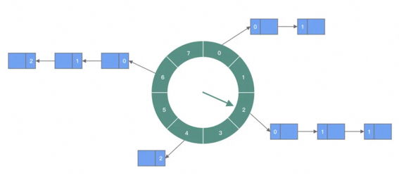
根据任务的到期时间进行取余和取模，然后根据取余结果将任务分布到不同的 slot 中，每个slot中根据round值决定是否操作，每次轮询到指定slot时，总时遍历最少round的对象进行执行，这样新增、执行两个操作的时间复杂度都近似O(1)。如果冲突较大可以增加数组长度，或者采用多级时间轮的方式处理。
```
public HashedWheelTimer(        ThreadFactory threadFactory, //线程池，但是只创建了一个线程        long tickDuration, //时针每次 tick 的时间，相当于时针间隔多久走到下一个 slot        TimeUnit unit,             //表示 tickDuration 的时间单位，tickDuration * unit        int ticksPerWheel,  //时间轮上一共有多少个 slot，默认 512 个。boolean leakDetection,        long maxPendingTimeouts) {//最大允许等待任务数    // 省略其他代码    wheel = createWheel(ticksPerWheel); // 创建时间轮的环形数组结构    mask = wheel.length - 1; // 用于快速取模的掩码    long duration = unit.toNanos(tickDuration); // 转换成纳秒处理    workerThread = threadFactory.newThread(worker); // 创建工作线程    leak = leakDetection || !workerThread.isDaemon() ? leakDetector.track(this) : null; // 是否开启内存泄漏检测    this.maxPendingTimeouts = maxPendingTimeouts; // 最大允许等待任务数，HashedWheelTimer 中任务超出该阈值时会抛出异常}
```
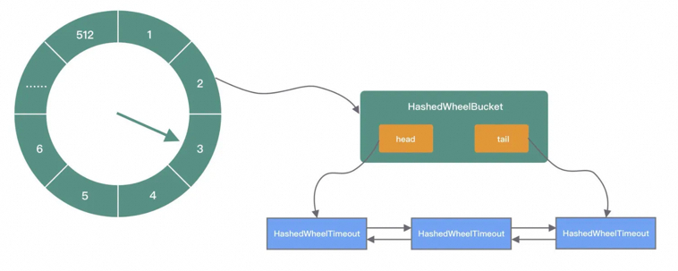
时间轮空推进问题
Netty 中的时间轮是通过固定的时间间隔 tickDuration 进行推动的，如果长时间没有到期任务，那么会存在时间轮空推进的现象，从而造成一定的性能损耗。此外，如果任务的到期时间跨度很大，例如 A 任务 1s 后执行，B 任务 6 小时之后执行，也会造成空推进的问题。
Kafka解决方案
**为了解决空推进的问题**，Kafka 借助 JDK 的 DelayQueue 来负责推进时间轮。DelayQueue 保存了时间轮中的每个 Bucket，并且根据 Bucket 的到期时间进行排序，最近的到期时间被放在 DelayQueue 的队头。Kafka 中会有一个线程来读取 DelayQueue 中的任务列表，**如果时间没有到，那么 DelayQueue 会一直处于阻塞状态**，从而解决空推进的问题。虽然DelayQueue 插入和删除的性能不是很好，但这其实就是一种权衡的策略，但是DelayQueue 只存放了 Bucket，Bucket 的数量并不多，相比空推进带来的影响是利大于弊的。
**为了解决任务时间跨度很大的问题**，Kafka 引入了层级时间轮，如下图所示。当任务的 deadline 超出当前所在层的时间轮表示范围时，就会尝试将任务添加到上一层时间轮中，跟钟表的时针、分针、秒针的转动规则是同一个道理。

**3、select、poll、epoll的区别**
**select** （windows）**poll **(linux)本质上和select没有区别，查询每个fd对应的设备状态，如果设备就绪则在设备等待队列中加入一项并继续遍历，如果遍历完所有fd后没有发现就绪设备，则挂起当前进程，直到设备就绪或者主动超时，被唤醒后它又要再次遍历fd。
**epoll **支持水平触发和边缘触发，最大的特点在于边缘触发，它只告诉进程哪些fd刚刚变为就绪态，并且只会通知一次。还有一个特点是，epoll使用“事件”的就绪通知方式，通过epoll_ctl注册fd，一旦该fd就绪，内核就会采用类似callback的回调机制来激活该fd，epoll_wait便可以收到通知。
Epoll空轮询漏洞
在 JDK 中， Epoll 的实现是存在漏洞的，即使 Selector 轮询的事件列表为空，NIO 线程一样可以被唤醒，导致 CPU 100% 占用。实际上 Netty 并没有从根源上解决该问题，而是巧妙地规避了这个问题。
```
long time = System.nanoTime();if (/*事件轮询的持续时间大于等于 timeoutMillis*/) {    selectCnt = 1;} else if (/*不正常的次数 selectCnt 达到阈值 512*/) {    //重建Select并且SelectionKey重新注册到新Selector上      selector = selectRebuildSelector(selectCnt);}
```
NioEventLoop 线程的可靠性至关重要，一旦 NioEventLoop 发生阻塞或者陷入空轮询，就会导致整个系统不可用。


> 原文: <https://www.yuque.com/tulingzhouyu/db22bv/fbbnqbv2ry9lk1vq>